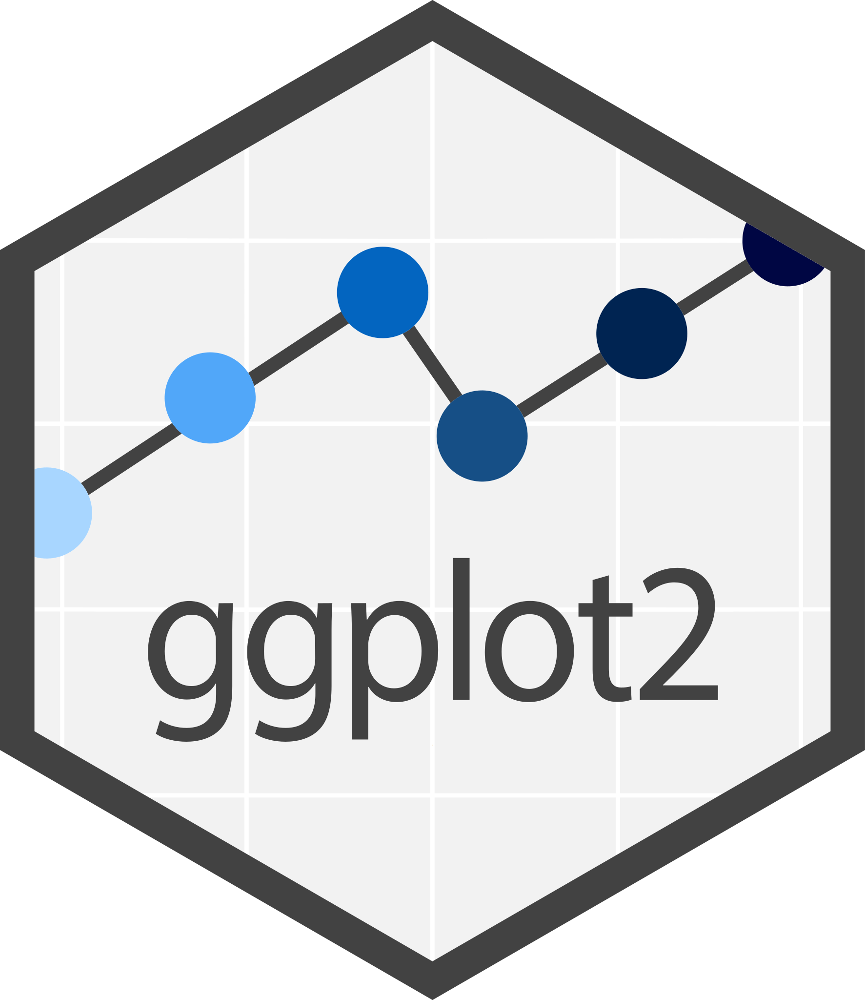
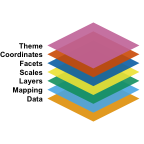
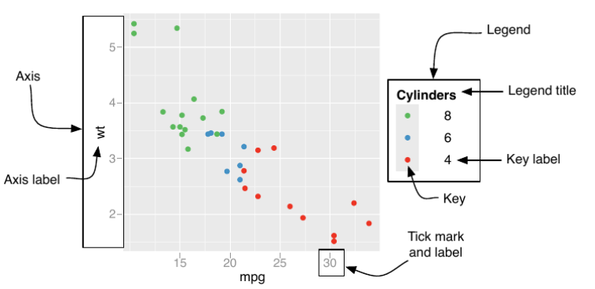

# Introduction to ggplot2

{.preview-images width=100}


In this chapter, we introduce **ggplot2**, a powerful plotting library in R for creating elegant and complex visualizations. We will guide you through the basics of ggplot2, including its grammar of graphics approach, and demonstrate how to create various types of plots. 


## What is ggplot2?

ggplot2 is part of the tidyverse collection of R packages, developed by Hadley Wickham [@wickham2010layered]. He received the COPSS Presidents' Award for his contributions to the tidyverse collection. It is based on the grammar of graphics [@wilkinson2011grammar]. As part of the tidyverse, it shares a framework that allows users to build plots layer by layer. This approach makes it highly flexible and intuitive once you understand its core concepts.

# Basic Concepts of the Grammar of Graphics

::: {.callout-tip}
# Discussion
Based on the data we collected in the first lecture:

- What kind of message can be expressed through visualization?
- What kind of graph will you use?
- Why will you choose this graph to express such an idea?
:::

{.lightbox}


The concept of the grammar of graphics was first proposed by Wilkinson [@wilkinson2011grammar] (I cite the second edition, but it was initially described in the first edition in 2005). It outlines the seven basic elements of a statistical graph:

1. **Data**:
   - The information to visualize.
  
2. **Mapping**:
   - How data variables connect to aesthetic attributes.
   - Displayed as x, y, color, shape, etc.

3. **Layer**:
   - Combines **geometric elements** (geoms: points, lines, polygons) and **statistical transformations** (stats: e.g., binning for histograms, fitting models).
   - Represents what is visually displayed in the plot.
  
4. **Scales**:
   - Map data values to aesthetic values (e.g., color, size).
   - Generate legends and axes for reading original data values.
  
5. **Coordinate System (Coord)**:
   - Defines how data is mapped to the plot plane.
   - Provides axes and gridlines (e.g., Cartesian, polar, map projections).
  
6. **Facet**:
   - Breaks data into subsets for small multiple plots (also called conditioning or trellising).

7. **Theme**:
   - Adjusts visual elements like fonts and colors.
   - Default settings in ggplot2 are carefully chosen, but customization may require references like Tufte (1990, 1997, 2001).

Although this approach identifies individual elements of a statistical graph, it has faced several critiques:

1. Which graph should I use?
2. This framework does not work well in a programming language context, and later, Wickham [@wickham2010layered] implicitly modified these layers.
3. It does not account for interactive graphs.

# Choosing the Visualization

Deciding which plot to use can sometimes be ambiguous for the user. The following questions and decision flowchart will help you determine which type of graph to use (at least within the scope of this course):

1. What is the purpose of displaying the graph?
2. What types of data are you going to present?

```{mermaid}
flowchart LR
  A{Data type} -->|Continuous| B{Purpose}
  A{Data type}  -->|Discrete| C{Purpose}

  B{Purpose}-->|Exploration| D((Histogram/Boxpot))
  B{Purpose} -->|Association| E((Scatter plot))
  B{Purpose} -->|Association+time| T((Line plot))

  C{Purpose}-->|Exploration| F((Bar chart))
  C{Purpose} -->|Association| G((Tree map))
```

# Getting Started

To use ggplot2, you first need to install and load the package in R:

```{webr}
#| message: false
# Install ggplot2 and patchwork if not already installed
install.packages("ggplot2")  # Core package for advanced plotting
install.packages("patchwork")  # Package for combining multiple plots

# Load the libraries into the current R session
library(ggplot2)  # For creating visualizations using grammar of graphics
library(patchwork)  # For arranging multiple ggplot objects
```

## Basic Plot Example

Before we start, let's take a look at the data we are going to use:

```{webr}
# Prepare the dataset by copying mtcars and converting 'am' to a factor
mtcars2 <- mtcars
mtcars2$am <- factor(
  mtcars$am, labels = c('automatic', 'manual')  # Label transmission types
)
head(mtcars2)
```

### Data and mapping layer
Let's create a simple scatter plot using the `mtcars` dataset, which is built into R:

```{webr}
#| label: fig-1
#| fig-cap: "Scatter plot of MPG vs cylinders, colored by transmission type."
#| message: false
library(ggplot2)  # Ensure ggplot2 is loaded for plotting

# Prepare the dataset by copying mtcars and converting 'am' to a factor
mtcars2 <- mtcars
mtcars2$am <- factor(
  mtcars$am, labels = c('automatic', 'manual')  # Label transmission types
)

# Initialize a ggplot object with data and aesthetic mappings
p <- ggplot(data=mtcars2, mapping = aes(x = mpg, y = cyl, colour = am))
p  # Display the base plot (no layers added yet)

# Alternative syntax (commented out) using positional arguments
# p <- ggplot(mtcars2, aes(mpg, cyl, color = am))
# p
```

From the code, you can see that data and mapping are encoded in the first line of the ggplot function:

$$
\text{ggplot}(\text{data=}\underbrace{\text{mtcars2}}_{\text{data}},
\text{mapping=}\underbrace{\text{aes(x = mpg, y = cyl, colour=am)}}_{\text{mapping}})
$$

Occasionally (and quite frequently), you will see people omit everything on the left-hand side (LHS) of the equal sign for `data`, `mapping`, `x`, and `y`, as these are standard arguments in ggplot2.

There are also other mapping options besides color:

- **Size**
- **Line**
  - linetype
  - lineend
  - linejoin
- **Dot**
  - Shape

### Layers

These functions are named in the format `geom_XXXX`:

|                 |  Function name  | 
|-----------------|-----------------|
|    Histogram    | `geom_histogram()`   |
|    Box chart    | `geom_boxplot()`|
|    Bar chart    | `geom_bar()`    |
|  Scatter chart  | `geom_point()`|
|   Line chart    | `geom_line()`   |

#### One variable

```{webr}
#| label: fig-2
#| fig-cap: "Histogram of miles per gallon (MPG) distribution."
#| message: false
# Create a histogram to show the distribution of miles per gallon (mpg)
ggplot(mtcars2) + 
  geom_histogram(mapping = aes(x = mpg), binwidth=5)  # Binwidth sets the width of histogram bins

# Note: This is equivalent to using a pre-defined plot object 'p'
# p + geom_histogram(mapping = aes(x = mpg), binwidth=5)
```

```{webr}
#| label: fig-3
#| fig-cap: "Boxplot of miles per gallon (MPG) distribution."
#| message: false
# Create a boxplot to summarize the distribution of miles per gallon (mpg)
ggplot(mtcars2) + 
  geom_boxplot(mapping = aes(y = mpg))  # Boxplot on y-axis for mpg
```

#### Two variables
```{webr}
#| label: fig-4
#| fig-cap: "Scatter plot of MPG vs cylinders, colored by transmission type."
#| message: false
# Create a scatter plot to show relationship between mpg and cylinders, colored by transmission
ggplot(mtcars2, aes(mpg, cyl, color = am)) +
  geom_point()  # Add points layer to represent individual data points

```
### Scales

Scales are functions (or processes) that transform data for the graph. This process is often automatic, based on the type of layer and data, so users typically only need to modify the axis or legend display. These functions are named in the format `scale_(AES)_(datatype)`:

|                 |         Discrete           |        Continuous        |
|-----------------|----------------------------|--------------------------|
|    X            |    `scale_x_discrete()`    |  `scale_x_continuous()`  |
|    Y            |    `scale_y_discrete()`    |  `scale_y_continuous()`  |
|  color          | `scale_color_discrete()`   | `scale_color_discrete()` |

 The argument and its corresponding components are listed in the below table and figure.

| Argument name	  |     Axis     |   Legend  |
|-----------------|--------------|-----------|
| name            |     Label    |   Title   |
| breaks          |     Ticks    |    Key    |
| labels          |  Tick label  | Key Label |

: {.striped .hover}

{.lightbox}

```{webr}
#| label: fig-5
#| fig-cap: "Scatter plot of MPG vs cylinders with customized axis and legend labels."
#| message: false
# Create a scatter plot with customized axis and color legend labels
ggplot(mtcars2, aes(mpg, cyl, color = am)) +
  geom_point() +  # Add points layer for data representation
  scale_x_continuous(name="Miles per gallon") +  # Customize x-axis label
  scale_colour_discrete(name="Automatic/Manual")  # Customize color legend title

```
### Coordinates and facet

Coordinates refer to the coordinate system of the graph and can help you adjust your plot. For most data we encounter, you sometimes need to adjust the range of the x and y axes. This can be done using the arguments `xlim=c(LOWER_BOUND, UPPER_BOUND)` for the x-axis and `ylim=c(LOWER_BOUND, UPPER_BOUND)` for the y-axis.


```{webr}
#| label: fig-6
#| fig-cap: "Scatter plot of MPG vs cylinders with customized axis limits."
#| message: false
# Create a scatter plot with customized axis limits and labels
ggplot(mtcars2, aes(mpg, cyl, color = am)) +
  geom_point() +  # Add points layer for data representation
  scale_x_continuous(name="Miles per gallon") +  # Customize x-axis label
  scale_colour_discrete(name="Automatic/Manual") +  # Customize color legend title
  coord_cartesian(xlim=c(10,40), ylim=c(1,8))  # Set specific limits for x and y axes


```

Facets allow you to break data into several subgraphs, separated by different subgroups. You can specify this with the notation: 
1. For a one-factor scenario, use `~ FACTOR_A`, which generates subplots for each level of `FACTOR_A`. (You can additionally specify `nrow=x` or `ncol=x` to arrange them over rows or columns.)
2. For a two-factor scenario, use `FACTOR_A ~ FACTOR_B`, which spreads `FACTOR_B` over rows and `FACTOR_A` over columns.

```{webr}
#| label: fig-7
#| fig-cap: "Scatter plot of MPG vs cylinders with customized axis limits."
#| message: false
# Create a scatter plot with customized axis limits and labels
ggplot(mtcars2, aes(mpg, cyl)) +
  geom_point() +  # Add points layer for data representation
  scale_x_continuous(name="Miles per gallon") +  # Customize x-axis label
  facet_wrap(~am, nrow = 2, ncol=1)

```

From time to time, you might want each subplot to share (or not share) the same scale (axis). You can specify this through the argument `scales=XXX` in the `facet_wrap()` function. The options for `scales` are listed below:

|              | free x axis | fixed x axis  |
|--------------|-------------|---------------|
|  free y axis |   `free`    |    `free_y`   |
| fixed y axis |  `free_x`   |    `fixed`    |

### Theme

There are several available options for the theme of your plot. Additionally, third-party packages like `ggtheme` offer different themes for plots.
```{webr}
#| label: fig-8
#| fig-cap: "Comparison of different ggplot2 themes applied to a scatter plot of MPG vs cylinders."
#| message: false
# Initialize base plot with customized axis limits and labels
p <- ggplot(mtcars2, aes(mpg, cyl, color = am)) +
  geom_point() +  # Add points layer for data representation
  scale_x_continuous(name="Miles per gallon") +  # Customize x-axis label
  scale_colour_discrete(name="Automatic/Manual") +  # Customize color legend title
  coord_cartesian(xlim=c(10,40), ylim=c(1,8))  # Set specific limits for x and y axes

# Apply different themes to the base plot for comparison
p_grey <- p + theme_grey() + ggtitle("theme_grey()")  # Default grey background theme
p_bw <- p + theme_bw() + ggtitle("theme_bw()")  # Black and white theme
p_ld <- p + theme_linedraw() + ggtitle("theme_linedraw()")  # Line-drawn theme
p_l <- p + theme_light() + ggtitle("theme_light()")  # Light theme with minimal grid
p_d <- p + theme_dark() + ggtitle("theme_dark()")  # Dark background theme
p_m <- p + theme_minimal() + ggtitle("theme_minimal()")  # Minimalist theme
p_c <- p + theme_classic() + ggtitle("theme_classic()")  # Classic theme without grid
p_v <- p + theme_void() + ggtitle("theme_void()")  # Empty theme with no background or grid

# Combine all themed plots for display using patchwork
# Arrange plots in a grid layout with 2 columns
p_grey + p_bw + p_ld + p_l + p_d + p_m + p_c + p_v + plot_layout(ncol = 2)
```
# Reading R documentation

It is by no means possible to cover all functions and attributes in this library, even though `ggplot2` is relatively stable. The key to thriving in the coding world is to understand the mechanisms and concepts behind the code. For the rest, you can refer to the official documentation from the library authors:


```{webr}

# Checking the documentation of geom_bar()

??ggplot::geom_bar()

```

## Wrap-up 

As a wrap-up, your code typically follows this structure:

$$
\small
\begin{aligned}
\text{ggplot()}+ &\\
\underbrace{\text{geom\_XXXX(data=DATA,mapping=aes(x,y,color,...))}}_{\text{plotting data}}
 + &\\
 \underbrace{\text{scale\_AES\_TYPE(name="TITLE",breaks="TICK LOC",labels="TICK LAB")}}_{\text{Handeling axis, legend etc}}
+ & \\
\underbrace{ \text{coord\_cartesian(xlim=c(min,MAX), ylim=c(min,MAX))}}_{\text{Adjust coordinate systems}} + &\\
\underbrace{\text{ggtitle("CHART TITLE")}}_{\text{Plotting title}}
\end{aligned}
$$

::: {.callout-tip}
# About making graph
 From the code introduced, it will be great to reflect on  

- How does the code construction differ from your human process of plotting code?
- How does the 7 layer graphic language differ from the ggplot syntax?
- If you could make `ggplot` easier to use, how would you design it?
:::

# Final remarks and acknowledgement

## Save the plots

Add the function `ggsave("FILE_PATH+FILE_NAME.png")` after your ggplot instructions:

```{webr}
# Saving plots as figure_theme_grey.png at the folder figure
ggsave("figure/figure_theme_grey.png",p_grey)
```

## R generic visualization

R also provides generic functions for plotting data:

```{webr}
# boxplot
boxplot(mtcars2$mpg)
# histogram
hist(mtcars2$mpg)
# Scatter plot
plot(mtcars2$mpg,mtcars2$cyl, type = 'p')
# Line plot
plot(mtcars2$mpg,mtcars2$cyl, type = 'l')
```

These functions have limited customization options (although you can still edit the figure and axis labels), so they are less commonly used in scientific publications.

The materials and content are largely adapted from @wickham2016getting. You can access the latest edition on the book [website](https://ggplot2-book.org/), which also covers more advanced topics. For detailed information on how to use the code and each function, refer to the `ggplot2` library documentation via `??ggplot2`.

# Bibilography

::: {#refs}
:::
