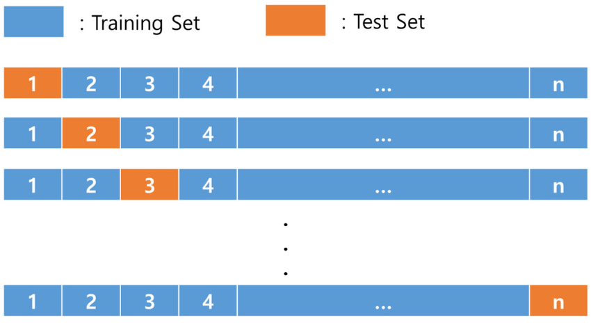

# Question set 1

## Overview of Question Set 1

This question set focuses on data manipulation with the mtcars dataset, including converting variables to factors, implementing Leave-One-Out Cross-Validation (LOOCV) for model prediction, classifying gear types based on probabilities, calculating model accuracy, and discussing the drawbacks of using for-loops for data frame manipulation.

First, we load mtcars data

```{r}
data <- mtcars
data
```

### Q1.

Again we want to make the data more informative, so please change the column `am` to factor such that 0 refers `automatic` and 1 refers `manual`.
You can use either:

1.  the `tidyverse` way to do it, or

2.  the way we did it during the lecture.

```{r}

```

## About Leave-one-out-cross validation (LOOCV)

LOOCV is a way to test how good a model is at making predictions.

1\.
Think of your data as a list of examples: In the mtcars dataset, you have 32 cars, each with an mpg and hp value.
Each car is one example.

2\.
Leave one example out at a time: In LOOCV, you pick one car (one example) to set aside as your "test" data.
The rest of the cars (31 in this case) become your "training" data.

3\.
Repeat for every example: You do this process for every single car in the dataset.
So, you’ll repeat it 32 times (once for each car).
Each time, one car is the test data, and the rest are used for training.

{width="568"}

### Q2.

Please use the first 31 rows as training data and the 32nd row as testing data, and call the function `train_n_predict` that Ray wrote to provide a probability and save it in `data$predict[32]` (because we used the 32nd row as the test data).

```{r}

train_n_predict <- function(train_data, test_data) {
    # Input:
    # train_data: mtcars data for training the model
    # test_data: mtcars data for testing the model
    # Output: 
    # Numerical value: probability that the car is a manual gear car

    model <- glm(am ~ mpg + cyl + disp + hp , data = train_data, family="binomial")
    return(predict(model, newdata = test_data,type = "response"))
}


```

### Q3.

Now, we need to do this for a total of 32 times:

1\.
For the first time, take out the first row as test data and use the rest of the 31 rows as training data.

2\.
For the second time, take out the second row as test data and use the rest of the 31 rows as training data.

3\.
And so on, for all 32 entries.

and remember to store the test result in `data$predict` (i.e., if the test data is the 1st row of the data, then `data$predict[1] <- train_n_predict(data[-1,], data[1,])`).

```{r}


```

### Q4.

After getting the probability, we need to match it back to the type of gear.
A straightforward solution is that the function `train_n_predict` gives the probability that the car is a manual car.
Therefore, if `data$predict > 0.5`, we can guess it is manual, and if `data$predict < 0.5`, we guess it is automatic.

Based on this idea, create a new column `data$p_class` with factor data type, where if `data$predict >= 0.5` it shall be `manual` (original label of manual car) and `automatic` if `data$predict < 0.5`.

```{r}

```

### Q5.

The purpose of this practice is to let Ray know how good or bad his model is, so you need to report the accuracy of the model.
It should be calculated as:

$$
\frac{\text{number of times model predict correctly}
}{\text{Total test samples}}
$$

```{r}

```

Q6.
Why do we keep not recommending using for-loop to manipulate data frames?
