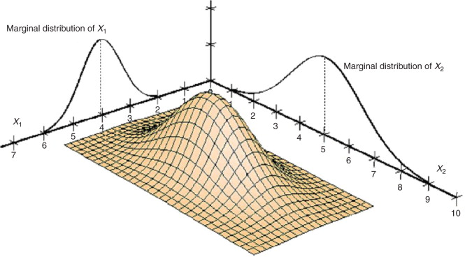

## Intended learning outcomes {.c}

- Apply definitions and theorems regarding joint, conditional, and marginal distributions.
- Recognize and explain Simpson's paradox.


## Random vector {.smaller}

A more general term for defining random variables: suppose we have $n$ random variables $x_1, x_2, \dots, x_n$. We can arrange them into a (column) vector $X$:

$$\begin{aligned}
X=\begin{bmatrix}
x_1\\
x_2\\
\vdots\\
x_n
\end{bmatrix}
= [x_1, x_2, ..., x_n ]^T
\end{aligned}
$$


**Definition**

An $n$-dimensional **random vector** is a mapping from a sample space $\mathcal{S}$ to an $n$-dimensional Euclidean space $\mathcal{R}^n$.

## Joint probability function {.smaller}

**Definition**

Given a discrete bivariate random vector $X=[x_1, x_2]$, the joint probability mass
function (pmf) is defined by

:::{.hide}
$$
f_{X}(a, b) \; \triangleq \; P_{x_1, x_2} \left(x_1 = a, x_2 = b\right) .
$$
:::

As the name suggests, the joint pmf also satisfies the following axioms:

$$
f_{X, Y}(x, y) \ge 0 \quad \forall \, (x, y) \in \mathbb{R}^2
$$

And
$$
\sum_{(x, y) \in \mathcal{R}^2} f_{X, Y}(x, y) = \sum_y\sum_x f_{X, Y}(x, y) = 1 .
$$


## Calculation of random vectors {.smaller}

**Mean**

:::{.hide}
$$
\small
\begin{align}
\mathbb{E}(X)=\begin{bmatrix}
\mathbb{E}(X_1)\\
\mathbb{E}(X_2)\\
\vdots\\
\mathbb{E}(X_n)
\end{bmatrix}
= [\mu_1, \mu_2, ..., \mu_n ]^T =\mathbb{\mu}
\end{align}
$$
:::

**Variances and Covariances** 

:::{.hide}
$$
\small
\begin{align}
& \mathbb{E}((X-\mathbb{\mu})(X-\mathbb{\mu})^T) =
\begin{bmatrix}
\sigma_{11} & \sigma_{12} & \dots & \sigma_{1n} \\
\sigma_{21} & \sigma_{22} & \dots & \sigma_{2n} \\
\vdots & \vdots &  & \vdots \\
\sigma_{n1} & \sigma_{n2} & \dots & \sigma_{nn} 
\end{bmatrix}
= \mathbb{\Sigma} \\
& \text{ where } \sigma_{ii}=\mathbb{V}(X_i) \text{, and }  \sigma_{ij}=cov(X_i,X_j) = \mathbb{E}((X_i-\mu_i)(X_j-\mu_j))
\end{align}
$$

:::

## Example {.smaller}
```{python}
import scipy.stats as stats
import matplotlib.pyplot as plt
import numpy as np

rv1=stats.multivariate_normal([0,0],cov=[[1,0],[0,1]]).rvs(size=1000)
rv2=stats.multivariate_normal([0,0],cov=[[1,0.7],[0.7,1]]).rvs(size=1000) 

fig,ax=plt.subplots(1,2)
ax[0].scatter(rv1[:,0],rv1[:,1],alpha=0.3,label="Standard normal distribution with Cov=0")
ax[0].scatter(rv2[:,0],rv2[:,1],alpha=0.3,label="Standard normal distribution with Cov=0.7")
ax[0].legend()
x, y = np.mgrid[-3:3:.01, -3:3:.01]
pos = np.dstack((x, y))
ax[1].contour(x, y, 
stats.multivariate_normal([0,0],cov=[[1,0],[0,1]]).pdf(pos), 
levels=10, cmap='Blues')
ax[1].contour(x, y, 
stats.multivariate_normal([0,0],cov=[[1,0.7],[0.7,1]]).pdf(pos), 
levels=10, cmap='Oranges')

```

## Marginal probability function {.smaller}

**Definition**

The marginal pmfs of random vector $X=(x_1, x_2)$ are defined by

:::{.hide}
$$
\begin{cases}
f_1(x_1) \; \triangleq \int_{-\infty}^{\infty} \; f(x_1,x_2)d x_2, \quad
f_2(x_2) \; \triangleq  \int_{-\infty}^{\infty} \; f(x_1,x_2)d x_1 \\
f_{x_1}(x_1) \triangleq  \sum_{x_2 \in X_2} f(x_1,x_2),  \quad
f_{x_2}(x_2) \triangleq  \sum_{x_1 \in X_1}f(x_1,x_2)
\end{cases}
$$
:::

The reason why it is called *marginal* as it marginalize out the variables not of your concern

{height=250}

## Example: Contingency table {.smaller}

:::{.columns}

:::{.column}

Consider a randomized treatment-control study observing potential improvements in reducing cancer incidence rates:

  |         | Cancer | Healthy |
  |---------|--------|---------|
  |Treatment|    3   |    97   |
  | Control |   21   |    70   |

:::

:::{.column}

Questions:

- What is the marginal probability of developing cancer?

:::{.hide}
$\frac{3+21}{3+97+70+21} = \frac{24}{191}$
:::

- What is the marginal probability of being selected for the treatment group?

:::{.hide}
$\frac{3+97}{3+97+70+21} = \frac{100}{191}$
:::


:::

:::

## Conditional probability {.smaller}

**Definition**

Given a random vector $(X, Y)$ if $P(Y) > 0$, then

:::{.hide}
$$
P( X \mid Y ) \triangleq 
\frac{P(X \cap Y)}{P(Y)} .
$$
:::

**Conditional probability distributions**

With joint pdf $f_{X,Y}(x,y)$ and marginal pdfs $f_X(x)$ and $f_Y(y)$,
for any $x$ such that $f_X(x) > 0$, the conditional pdf of $Y$
given that $X = x$ is defined by

:::{.hide}
$$
f_{Y \mid X}( y \mid x ) = \frac{ f_{X,Y}(x,y) }{ f_X(x) } 
$$
:::

Similarly, for any $y$ such that $f_Y(y) > 0$,

:::{.hide}
$$
f_{X \mid Y} \left( x \mid y \right) = \frac{ f_{X,Y}(x,y) }{ f_Y(y) } 
$$
:::

## Conditioning direction {.smaller}

**Direction matters**
$$
P\left(Y \mid X=x \right)
$$

The probability of $y$ given that I have observed the random variable $X=x$. Swapping the direction has a different implication:

**Denominator is a scalar**

$$
f_{Y \mid X}( y \mid x ) = \frac{ f_{X,Y}(x,y) }{ f_X(x) } 
$$

It is clear that the denominator is not a function of $y$. From $Y$'s perspective, the denominator is a scalar. This is an important calculation step for the rest of the class.


## Marginalization as an expectation of conditional probability {.smaller}

We can rewrite the equation for marginal probability as a product of conditional probability:

:::{.hide}
$$
f_X(X) = \int_{-\infty}^{\infty} \; f(x,y)dy = \int_{-\infty}^{\infty} \; f_{X \mid Y} ( x \mid y ) p_Y(y) dy = \mathbb{E}[f_{X \mid Y} ( x \mid Y )]
$$
:::

## Example: Contingency table (again) {.smaller}

:::{.columns}

:::{.column}

Consider a randomized treatment-control study observing potential improvements in reducing cancer incidence rates:

  |         | Cancer | Healthy |
  |---------|--------|---------|
  |Treatment|    3   |    97   |
  | Control |   21   |    70   |

:::

:::{.column}

Questions:

- What is the probability of developing cancer given that you are in the treatment group?

:::{.hide}

$\frac{3}{100}=\frac{\frac{3}{191}}{\frac{100}{191}}$

:::

- What is the probability of developing cancer given that you are in the control group?

:::{.hide}

$\frac{21}{91}=\frac{\frac{21}{191}}{\frac{91}{191}}$

:::


:::

:::

## Statistical independence {.smaller}

**Definition**

Given a random vector $(X, Y)$, $X$ and $Y$ are
**independent** if and only if (iff),

:::{.hide}
$$
f_{X, Y}(x, y) = f_X(x) f_Y(y) .
$$
:::

If $X$ are $Y$ are independent, we write $X \perp Y$.

By this definition, it implies the following three properties:

:::{.hide}
$$
\small
\begin{align}
X \perp Y \; \Rightarrow \quad & f_{Y \mid X}(y \mid x) = f_Y(y) \\
& \mathbb{E}(XY) =\mathbb{E}(Y)\mathbb{E}(Y) \\
& \sigma_{xy}=0
\end{align}
$$
:::

*Note*: The converse of the last property is not always true.

**Implication**

:::{.hide}

- Independence = one event conveys no information about the other
- Independence does not mean mutually exclusive events.

:::

## Example: Contingency table (again..) {.smaller}

:::{.columns}

:::{.column}

Consider a randomized case-control study observing potential improvements in reducing cancer incidence rates:

  |         | Cancer | Healthy |
  |---------|--------|---------|
  |Treatment|    3 (a)  |    97 (c)  |
  | Control |   21 (b)  |    70 (d)  |

:::

:::{.column}

Questions:

- If cancer development is independent from whether treatment was received, what could be the possible relationship of $a, b, c, d$?

:::{.hide}

$\frac{a}{b}=\frac{c}{d}$ or $\frac{a}{c}=\frac{b}{d}$ 

:::

- What is the implication for the effectiveness of the intervention if cancer development is independent from whether treatment was received?

:::{.hide}

Treatment does not reduce the chance of developing cancer
:::


:::

:::


## Simpson's paradox {.smaller}

While the presence or absence of some confounding variable changes the probability distribution:
$$
\frac{P\left( Y = 1 \mid X = x_1 \right) }{ P\left( Y = 1 \mid X = x_2 \right)}
 = c
$$

However, conditioned on $Z = z$ for some $z$,
$$
\frac{P\left( Y = 1 \mid X = x_1, Z = z \right) }{ P\left( Y = 1 \mid X = x_2, Z = z \right)} \neq \frac{P\left( Y = 1 \mid X = x_1 \right) }{ P\left( Y = 1 \mid X = x_2 \right)}
$$


## Example: Treatment of Kidney Stones? {.smaller}


:::{.columns}

:::{.column}

A study by @bonovas2023simpson comparing open surgery versus percutaneous nephrolithotomy (PCNL) for treating kidney stones:

  |         | Open Surgery | PCNL |
  |---------|--------------|------------------------------|
  | Success |    273       |            289               |
  |  fail   |    77        |            61                |


:::

:::{.column}

Questions:

- What is the probability of successfully removing a kidney stone if you undergo:
  
  - Open Surgery <span class="hide">$\frac{273}{350}$</span>
  - PCNL <span class="hide">$\frac{289}{350}$</span>


- Based on the above probabilities, which surgery would you choose?

:::{.hide}
Percutaneous Nephrolithotomy (PCNL)
:::

:::

:::

## Example: Treatment of Kidney Stones? {.smaller}


:::{.columns}

In clinical practice, doctors usually perform PCNL for stone diameters less than 2 cm and open surgery for stone diameters greater than or equal to 2 cm.

:::{.column width=40%}


  |         | Open Surgery | PCNL |
  |---------|--------------|------------------------------|
  | Success |     81       |            234               |
  |  fail   |     6        |            36                |
:  Stone diameter < 2 cm

  |         | Open Surgery | PCNL|
  |---------|--------------|------------------------------|
  | Success |    192       |             55               |
  |  fail   |     71       |             25               |
:  Stone diameter $\geq$ 2 cm

:::

:::{.column width=60%}

**Questions**:
Given that your stone diameter is less than 2 cm, what is the probability of successfully removing a kidney stone if you undergo:

**Implication**:

:::{.hide}

- Include all possible confounding variables in the analysis.
- Understand the context and how the data was collected.

:::

:::

:::

## Independence, association, and causal effects {.smaller}

**Association (statistical dependence) is not causation.**

From the overall table in the previous example, you might think that the type of surgery does not affect the outcome (*Note that this is a causal claim*).

But in reality the success or not also depends on the size of stone.

**Implication**

- Statistical dependencies are used to *approximate* causal effects by including possibly all confounders.


## Bibliography Note
