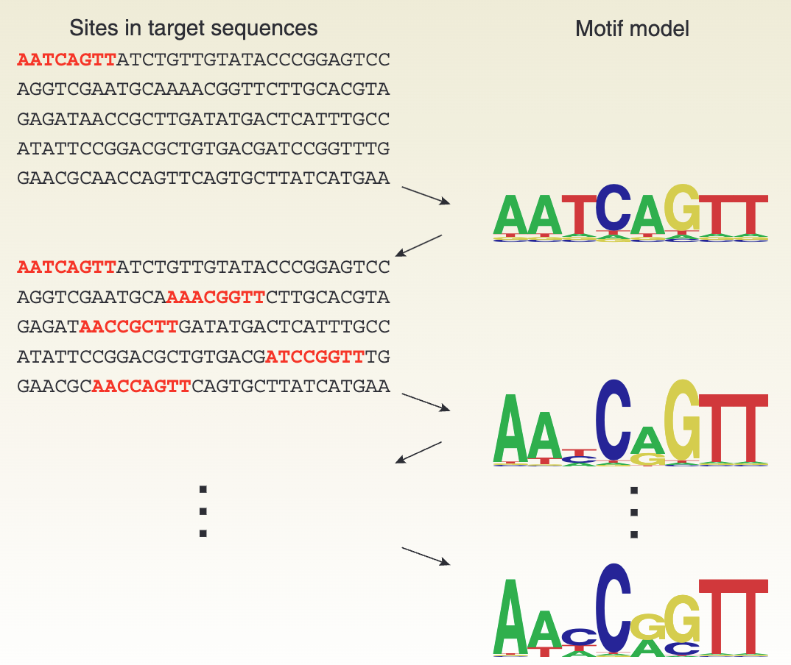
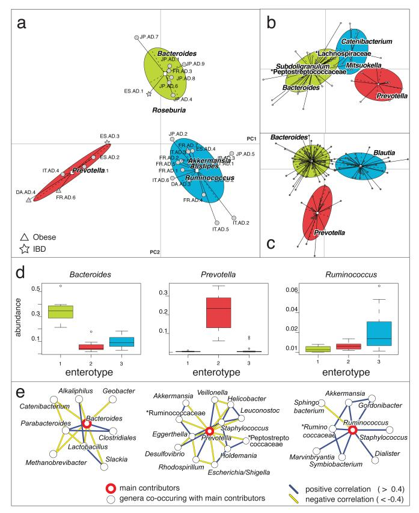

## Intended learning outcomes 

- Define the properties of Categorical, Multinomial, and Dirichlet distributions.
- Explain the use of the Dirichlet distribution as a conjugate prior and the concept of pseudo-counts.


## Categorical distribution {.smaller}

If a random variable $X$ has $k$ distinct outcomes ($k \geq 2$), then $X$ follows a Categorical distribution.


:::{.columns}

:::{.column}

 - Support: $x \in \{1,\dots, k\}$
 - Parameters: 
   - $p_1, p_2, \dots, p_k$ (noting that $\sum_{i=1}^k p_i = 1$ and $p_i \ge 0$)
 - pmf 

:::{.hide}
$$
p(X=i)=p_i
$$ 

:::

:::


:::{.column}

 - You can view the categorical distribution as a multivariate version of the Bernoulli distribution.
 - There are only $k-1$ free parameters since $p_k = 1 - \sum_{i=1}^{k-1} p_i$.

**Example**

- Phenotypes (e.g. A, B, O blood types)
- Nucleotide bases (e.g. A, T, C, G)

:::

:::

## Multinomial distribution {.smaller}

Similar to the univariate case, if we summarize the counts from repeated categorical trials, we obtain the Multinomial distribution.


:::{.columns}

:::{.column}

 - Support: $x_1,\dots,x_k \mid \sum_{i=1}^k x_i =n,\; x_i \in \mathbb{N}$
 - Parameters: 
   - $p_1, p_2, \dots, p_k$ (noting $\sum_{i=1}^k p_i = 1$ and $p_i \ge 0$)
   - $n$: number of trials
 - pmf 

:::{.hide}
  $$
  \frac{n!}{x_1!\dots x_k!}p_1^{x_1}\dots p_k^{x_k}
  $$ 

:::

:::


:::{.column}

 - Again, there are only $k-1$ free parameters since $p_k = 1 - \sum_{i=1}^{k-1} p_i$.

**Example**

Summary of categorical data

:::

:::

## Dirichlet distribution {.smaller}

The Dirichlet distribution is the conjugate prior of the Categorical and Multinomial distributions. It describes the belief about the probability vector $p$ in these models.

:::{.columns}

:::{.column}

 - Support: $p_1,\dots, p_k$
 - Parameters: $\alpha_1,\dots, \alpha_k$ 
 - pdf 
  $$
  \frac{1}{B(\mathbf{\alpha})}\prod_{i=1}^{k} p_i^{\alpha_i-1}
  $$ 

:::


:::{.column}

 - You can view the Dirichlet distribution as a multivariate version of the Beta distribution.


```{python}
import numpy as np
import matplotlib.pyplot as plt
from scipy.stats import dirichlet
import matplotlib.tri as tri
 
def plot_dirichlet_simplex(alphas, ax):
    """
    Plots the Dirichlet distribution PDF on a simplex.
    """
    # Define the simplex corners
    corners = np.array([[0, 0], [1, 0], [0.5, np.sqrt(3)*0.5]])
    triangle = tri.Triangulation(corners[:, 0], corners[:, 1])
 
    # Create a grid of points in barycentric coordinates
    # We generate points in a triangle and map them back to p1, p2, p3
    refiner = tri.UniformTriRefiner(triangle)
    trimesh = refiner.refine_triangulation(subdiv=7)
    # Convert Cartesian (x, y) to Barycentric (p1, p2, p3)
    # The inverse transformation of:
    # x = p2 + 0.5 * p3
    # y = sqrt(3)/2 * p3
    # p1 = 1 - p2 - p3
    y = trimesh.y
    x = trimesh.x
    p3 = y / (np.sqrt(3)/2)
    p2 = x - 0.5 * p3
    p1 = 1 - p2 - p3
    # Clip small negative values due to float precision
    p1 = np.clip(p1, 1e-6, 1)
    p2 = np.clip(p2, 1e-6, 1)
    p3 = np.clip(p3, 1e-6, 1)
    # Normalize to ensure sum is exactly 1 (though clipping might slightly offset, it's for viz)
    total = p1 + p2 + p3
    p1 /= total
    p2 /= total
    p3 /= total
    # Stack to shape (N, 3)
    p = np.vstack((p1, p2, p3)).T
    # Calculate PDF
    # Handle the case where points might be slightly outside due to triangulation
    pdf_vals = []
    rv = dirichlet(alphas)
    # Calculation might fail or warn if sum is not perfectly 1 or values < 0, 
    # but our manual normalization handles most.
    # We calculate per point.
    try:
        pdf_vals = rv.pdf(p.T)
    except ValueError:
        # Fallback or strict clipping if pdf fails
        pdf_vals = np.zeros(p.shape[0])
        for i in range(p.shape[0]):
            try:
                pdf_vals[i] = rv.pdf(p[i])
            except:
                pdf_vals[i] = 0
 
    # Contour plot
    ax.tricontourf(trimesh, pdf_vals, 100, cmap='PuBu')
    ax.set_aspect('equal')
    ax.axis('off')
    # Label corners
    ax.text(0, 0, r'$X_1$', ha='right', va='top', fontsize=12)
    ax.text(1, 0, r'$X_2$', ha='left', va='top', fontsize=12)
    ax.text(0.5, np.sqrt(3)/2, r'$X_3$', ha='center', va='bottom', fontsize=12)
    ax.set_title(f'$\\alpha = {alphas}$', y=1.05)
 
# Setup figure
fig, axes = plt.subplots(2, 2, figsize=(5,4))
alpha_configs = [
    (1, 1, 1),      # Uniform
    (0.8, 0.8, 0.8), # Sparse (corners) - using 0.8 to avoid infinity at edges in visualization if possible or just show tendency
    (5, 5, 5),      # Concentrated (center)
    (2, 5, 10)      # Asymmetric
]
 
# Adjust (0.8, 0.8, 0.8) to something that visualizes "corner" tendency better without breaking pdf calc at 0
# Actually < 1 values go to infinity at corners.
# For visualization, (0.9, 0.9, 0.9) is safer to plot or we just handle the high values.
# Let's use (2, 2, 2) instead of (0.8,...) for "somewhat spread but central" and (0.99) for corners? 
# Or just stick to the standard examples. 
# Let's try (0.9, 0.9, 0.9) and see. If it fails, I will use (0.99, 0.99, 0.99).
# Actually, let's use a clear "Sparse" example: (0.1, 0.1, 0.1) but plotting log-pdf or capping might be needed.
# Let's stick to safe alphas >= 1 for contour plots usually, but users want to see the difference.
# I will use (0.8, 0.8, 0.8) but I need to be careful about PDF values exploding. 
# Re-eval: (0.9, 0.9, 0.9) is fine, values are high but finite if we stay away from exact 0.
# My grid generation keeps 1e-6 distance.
 
# Let's pick a visually distinct set:
alpha_configs = [
    (1, 1, 1),       # Uniform
    (12, 6, 2), # Sparse-ish (tending to corners)
    (5, 5, 5),       # Dense (center)
    (2, 6, 12)       # Asymmetric
]
 
for ax, alpha in zip(axes.flat, alpha_configs):
    cntr=plot_dirichlet_simplex(alpha, ax)

plt.tight_layout()
```
:::

:::

## Bayesian estimation {.smaller}

- Motivation: We tries to incorporate our knowledge and experience to estimate the parameters of a distribution.
- From Bayes' theorem, we can use the prior distribution to update our belief about the parameters after observing the data. In mathematical terms, we have

:::{.hide}
$$
p(\theta|X) = \frac{
\underbrace{p(X|\theta)}_{\text{Evidence from the data}}\cdot\underbrace{p(\theta)}_{\text{Prior belief about $\theta$}}
}{\underbrace{p(X)}_{\text{Marginal likelihood of the data, not a function of $\theta$}}}
$$
:::

in short, in most of the calculation, we can write

:::{.hide}
$$
p(\theta|X) \propto p(X|\theta) \cdot p(\theta)
$$
:::

## Dirichlet as categorical distribution prior {.smaller}

:::{.columns}

:::{.column}
**Set up**

- $X = x_1,\dots,x_N$ are $N$ independent observations.
- Drawn from a Categorical distribution with $\textbf{p}=(p_1,\dots,p_K)$ and $K$ classes.
- Let $n_k$ be the count of observations in category $k$.

**Prior**

- A Dirichlet prior $P(\textbf{p} \mid \mathbf{\alpha}) = \text{Dir}(\textbf{p} \mid \mathbf{\alpha}) = \frac{1}{\text{B}(\mathbf{\alpha})} \prod_{i=1}^K p_i^{\alpha_i - 1}$

:::

:::{.column}

From Bayes' theorem, we have


:::{.hide}
$$
\small
P(\textbf{p} \mid X) \propto P(X \mid \textbf{p}) P(\mathbf{p} \mid \mathbf{\alpha})
$$
:::

For simplification, let $c=(c_1,\dots,c_k)$ as the count of observations in each category, and the posterior distribution of the parameter is

:::{.hide}
$$
\small
\begin{aligned}
P(\textbf{p} \mid \textbf{X} ) \propto & \left( \prod_{i=1}^K p_i^{c_i} \right) \left( \prod_{i=1}^K p_i^{\alpha_i - 1} \right) \\
\propto & \prod_{i=1}^K p_i^{c_i + \alpha_i - 1}
\end{aligned}
$$
:::


:::

:::

## The Posterior Predictive Distribution {.smaller}

Thep posterior distribution has the kernel (functional form) of a Dirichlet distribution with updated parameters $\mathbf{\alpha}'$:

:::{.hide}
$$
\small
\mathbf{\alpha}' = (\alpha_1 + c_1, \alpha_2 + c_2, \dots, \alpha_K + c_K)
$$
:::

**Interpretation**: <span class="hide">adding $\alpha_i$ pseudo-counts to the observed counts $c_i$ for each category $i$. </span>


**Posterior predictive distribution**

Intuitively speaking if we want to guess the probability of the next observation $x_{N+1}$ being category $j$ is still a **Categorical distribution**, 

but we need to use the updated parameters $\mathbf{\alpha}'$ to calculate the :

:::{.hide}
$$
P(x_{N+1} = j \mid D, \mathbf{\alpha}) = \frac{\alpha_j + c_j}{\sum_{i=1}^K (\alpha_i + c_i)}
$$
:::

## Illustration of Dirichlet Prior {.smaller}

Dirichlet prior adds a psuedo $\alpha$ observations. (The observed data is [8,2,2])

```{python}
import numpy as np
import matplotlib.pyplot as plt

# Define data
counts = np.array([8, 2, 2])
categories = ['Cat A', 'Cat B', 'Cat C']
x = np.arange(len(categories))
width = 0.25 

# MLE: Normalized observed counts
mle_p = counts / np.sum(counts)

scenarios = [
    ("Flat Prior", [1, 1, 1]),
    ("Strong Balanced Prior", [15, 15, 15]),
    ("Strong Biased Prior", [2, 2, 15])
]

fig, axes = plt.subplots(1, 3, figsize=(15, 5.7), sharey=True)

for i, (name, prior_alpha) in enumerate(scenarios):
    prior_alpha = np.array(prior_alpha)
    posterior_alpha = prior_alpha + counts
    
    prior_p = prior_alpha / np.sum(prior_alpha)
    posterior_p = posterior_alpha / np.sum(posterior_alpha)
    
    ax = axes[i]
    ax.bar(x - width, prior_p, width, label='Prior Mean', color='lightgray', hatch='//')
    ax.bar(x, mle_p, width, label='MLE (Data)', color='orange')
    ax.bar(x + width, posterior_p, width, label='Posterior Mean', color='skyblue')
    
    ax.set_title(f"{name}\nPrior $\\alpha$={prior_alpha}")
    ax.set_xticks(x)
    ax.set_xticklabels(categories)
    if i == 0: ax.legend()

# plt.suptitle(f"Dirichlet Prior vs MLE vs Posterior Comparison", fontsize=16)

```

## Dirichlet as a multinomial distribution prior {.smaller}

:::{.columns}

:::{.column}
**Set up**

- $X = x_1,\dots,x_n$ are observations drawn from a Multinomial distribution with $P=(p_1,\dots,p_K)$ and $K$ classes.

**Prior**
 
A Dirichlet prior $P(\textbf{p} \mid \mathbf{\alpha}) = \text{Dir}(\textbf{p} \mid \mathbf{\alpha}) = \frac{1}{\text{B}(\mathbf{\alpha})} \prod_{i=1}^K p_i^{\alpha_i - 1}$

The probability of observing this data is

:::{.hide}
$$
\small
p(X|p)= \frac{n!}{x_1!\dots x_k!}\prod_{j=1}^K p_j^{x_j} \propto \prod_{j=1}^K p_j^{x_j}
$$
:::

:::

:::{.column}
Using Bayes' Rule, the posterior is proportional to the Likelihood times the Prior:
$$
P(\textbf{p} \mid \textbf{X}, \mathbf{\alpha}) \propto P(\textbf{X} \mid \textbf{p}) P(\textbf{p} \mid \mathbf{\alpha})
$$

Dropping the constants (terms not involving $\textbf{p}$) to find the kernel:

:::{.hide}
$$
P(\textbf{p} \mid \mathbf{x}, \mathbf{\alpha}) \propto \left( \prod_{i=1}^K p_i^{x_i} \right) \left( \prod_{i=1}^K p_i^{\alpha_i - 1} \right)
$$
:::


:::

:::

## Illustration {.smaller
}

Thep posterior distribution has the kernel (functional form) of a Dirichlet distribution with updated parameters $\mathbf{\alpha}'$:

:::{.hide}
$$
\begin{aligned}
\mathbf{\alpha}' = (\mathbf{\alpha} + \textbf{x}) = (\alpha_1 + x_1, \alpha_2 + x_2, \dots, \alpha_K + x_K)
\end{aligned}
$$
:::

**Interpretation**: The $\alpha_i$ values act as "imaginary" observations seen before the experiment.

```{python}
import numpy as np
import matplotlib.pyplot as plt
import matplotlib.tri as tri
from scipy.stats import dirichlet

def plot_dirichlet_simplex(alphas, ax, title="", show_mle=False, mle_point=None):
    """
    Plots a Dirichlet distribution on a 2-simplex (equilateral triangle).
    """
    # Define the corners of the triangle
    corners = np.array([[0, 0], [1, 0], [0.5, 0.75**0.5]])
    triangle = tri.Triangulation(corners[:, 0], corners[:, 1])

    # Create a refined grid of points for smooth plotting
    refiner = tri.UniformTriRefiner(triangle)
    trimesh = refiner.refine_triangulation(subdiv=5)
    
    # Convert Cartesian grid to Barycentric coordinates
    x = trimesh.x
    y = trimesh.y
    l3 = y / (0.75**0.5)
    l2 = x - 0.5 * l3
    l1 = 1 - l2 - l3
    bary = np.vstack((l1, l2, l3)).T
    
    # Numerical stability: Clip and Normalize
    bary = np.clip(bary, 1e-9, 1.0)
    bary = bary / bary.sum(axis=1, keepdims=True)
    
    # Calculate PDF values
    try:
        dist = dirichlet(alphas)
        z = dist.pdf(bary.T)
    except Exception:
        z = np.zeros_like(x)

    # Plot contours
    ax.tricontourf(trimesh, z, levels=20, cmap='Reds')
    ax.triplot(triangle, color='k', linewidth=1)
    
    # Labels
    ax.text(-0.05, -0.05, 'Cat 1', ha='center', fontsize=9)
    ax.text(1.05, -0.05, 'Cat 2', ha='center', fontsize=9)
    ax.text(0.5, 0.75**0.5 + 0.05, 'Cat 3', ha='center', fontsize=9)
    
    # Plot MLE point (Red Star)
    if show_mle and mle_point is not None:
        # Convert MLE barycentric to Cartesian
        mle_cart_x = mle_point[1]*1.0 + mle_point[2]*0.5
        mle_cart_y = mle_point[2]*(0.75**0.5)
        ax.plot(mle_cart_x, mle_cart_y, 'r*', markersize=15, 
                markeredgecolor='white', label='MLE')

    ax.set_title(title, fontsize=10)
    ax.axis('off')
    ax.set_aspect('equal')

# --- Main Script ---

# 1. Define Data: Observed counts [Cat1, Cat2, Cat3]
data_counts = np.array([2, 8, 2])
mle_est = data_counts / data_counts.sum()

# 2. Define Priors
priors = [
    {'name': 'Uniform Prior', 'alpha': np.array([1, 1, 1])},
    {'name': 'Peaked Center', 'alpha': np.array([10, 10, 10])},
    {'name': 'Biased to Cat 1', 'alpha': np.array([20, 2, 2])}
]

# 3. Generate Plots
fig, axes = plt.subplots(2, 3, figsize=(12, 4))

for i, case in enumerate(priors):
    prior_alpha = case['alpha']
    posterior_alpha = prior_alpha + data_counts
    
    # Prior (Top Row)
    plot_dirichlet_simplex(prior_alpha, axes[0, i], 
                           title=f"$\\alpha={list(map(str,prior_alpha))}$")
    
    # Posterior (Bottom Row)
    plot_dirichlet_simplex(posterior_alpha, axes[1, i], 
                           title=f"$\\alpha_{{new}}={list(map(str,posterior_alpha))}$", 
                           show_mle=True, mle_point=mle_est)
fig.suptitle("observation = [2,8,2]", fontsize=16)
fig.text(0.01, 0.72, 'PRIOR', va='center', rotation='vertical', fontsize=14, fontweight='bold')
fig.text(0.01, 0.25, 'POSTERIOR', va='center', rotation='vertical', fontsize=14, fontweight='bold')
plt.tight_layout(rect=[0.03, 0, 1, 0.95])

```

## Interpretation of Dirichlet prior {.smaller}

|              | Categorical | Multinomial |
|--------------|-----------------------|-----------------------|
| Prior    | Dirichlet| Dirichlet |
| Posterior    | $\prod_{k=1}^Kp_k^{n_k+\alpha_k-1}$ | $\prod_{k=1}^Kp_k^{x_k+\alpha_k-1}$|
| Posterior predictive   | Categorical | Dirichlet-multinomial |

 - Interpretation:
   - Adding a Dirichlet prior is equivalent to adding $\alpha$ pseudo-observations to the data.
   - As the number of observations increases, the influence of the prior decreases.

## Application in bioinformatics {.smaller}

:::{.columns}

:::{.column}

**Motif discovery**

{width=70%}
:::

:::{.column}

**Metagenomics**

{width=70%}


:::

:::

# Connection with linear regression (Optional)

## Generalized linear model {.smaller}

:::{.columns}

:::{.column}

Limitations of ordinary linear regression

- Count data (Multinomial/Poisson)
- Dichotomous or Multinomial outcomes (Bernoulli)
- Proportions (values between 0 and 1)

A generalized linear model (GLM) can model different kinds of data.

:::

:::{.column}

Components of GLM

- Random components 
  - Identify $Y$ and its distribution
- Systematic components
  - Linear predictor $\alpha + \beta_1 x_1 + \dots + \beta_k x_k$
- Link function
  - Given $\mu=E(Y)$, the link function $g(\cdot)$ satisfies
  $$g(\mu)=\alpha+\beta_1x_1+\dots+\beta_kx_k$$
:::

:::

## Logistic regression {.smaller}

:::{.columns}

:::{.column}
In logistic regression (binomial outcomes), the link function is 

Logit link function  
$$
\log\frac{p(x)}{1-p(x)}=\alpha+\beta x
$$

Transform them back to get $p(x)$

$$
p(x)=\frac{e^{\alpha+\beta x}}{1+e^{\alpha+\beta x}}
$$
:::

:::{.column}

For a dichotomous predictor $x$ with values 0 and 1, $\beta$ is the log odds ratio ($\log(\text{OR})$).

```{python}
import numpy as np
import matplotlib.pyplot as plt
 
def sigmoid(x):
  """Computes the sigmoid (inverse logit) of x.     Formula: 1 / (1 + exp(-x))"""
  return 1 / (1 + np.exp(-x))
 
# 1. Generate data# Create a sequence of "independent variable" values (Log-odds)
x_values = np.linspace(-10, 10, 500)
p_values = sigmoid(x_values)
 
# 2. Create the Plot
plt.figure(figsize=(5, 2.5))
plt.plot(x_values, p_values, color='blue', linewidth=2, label=r'$p = \frac{1}{1 + e^{-x}}$ (Sigmoid)')
 
# 3. Add Annotations for better understanding# Mark x = 0 (Log-odds = 0, p = 0.5)
plt.axvline(x=0, color='gray', linestyle='--', alpha=0.7)
plt.axhline(y=0.5, color='gray', linestyle='--', alpha=0.7)
plt.plot(0, 0.5, 'ro') # Red dot at center
plt.text(0.5, 0.45, 'x=0\np=0.5', color='red')
 
# Mark asymptotic behavior
plt.text(6, 0.9, r'$x \to +\infty$' + '\n' + r'$p \to 1$', ha='center')
plt.text(-6, 0.1, r'$x \to -\infty$' + '\n' + r'$p \to 0$', ha='center')
 
# 4. Formatting
plt.title('The Logistic (Sigmoid) Function\nMapping Independent Variable (Log-Odds) to Probability', fontsize=16)
plt.xlabel('Independent Variable $x$ (Log-Odds)', fontsize=14)
plt.ylabel('Probability $p$', fontsize=14)
plt.grid(True, which='both', linestyle='--', alpha=0.5)
plt.legend(fontsize=12)
plt.ylim(-0.05, 1.05)
plt.xlim(-10, 10)
```
:::

:::

Discussion: if we model $p(x)=\alpha+\beta x$, is it causing any trouble?

  - Potential estimate for $p(x)>1$ or $p(x)<0$


## Multinomial logistic regression {.smaller}

- How do we compare multiple categories?
  - 1 vs. n
  - n vs. n
  
- There are $k(k-1)/2$ pairs of comparisons, but actually, you only need $k-1$ non-redundant comparisons.

Let the category $K$ as the baseline, for each comparison of $k = 1,\dots,k-1$

**Baseline-category logit model **are
$$
\log(\frac{p_k(x)}{p_K(x)})=\alpha_k+\beta_kx \quad k=1,\dots,K-1
$$

## Interpretation of $\beta$ {.smaller}

The model assumes $\ln(\frac{p(x)}{1-p(x)})=\alpha+\beta x$, so for a given change $\Delta x$,

The odds at $x + \Delta x$ is 

$$
\frac{p(x + \Delta x)}{1-p(x + \Delta x)}=\exp(\alpha+\beta(x+\Delta x)) = \exp(\alpha+\beta(x))\exp(\beta\Delta x)
$$

The odds ratio (OR) for $x$ is

$$
\text{OR}=\frac{\text{odds at}(x+\Delta x)}{\text{odds at}(x)}=\frac{\exp(\alpha+\beta(x+\Delta x))}{\exp(\alpha+\beta(x))} = \exp(\beta\Delta x)
$$

- $\beta$ is the change in the log odds when x increases by 1 unit.
- Confidence interval of OR is not symmetric to the mean.

**How about alpha ?** 

# Connections with contingency tables


## Logistic regression v.s. Contingency table {.smaller}

|              | Logistic regression | Contingency table |
|--------------|---------------------|-------------------|
| Estimating   | OR                  |  OR               |
| Test on esstimation |  t-test/$\chi^2$ test            |  Fisher's exact test/$\chi^2$ test        |

- Advantage of logistic regression
  - Controlling other confounders
- Estimating OR for continuous variables
- Compatible with multinomial outcomes

## Back to the kidney stone example {.smaller}

:::{.columns}

In clinical practice, for stone diameters less than 2cm, doctors usually conduct PCNL, while open surgery is used for stone diameters of 2cm or greater.

:::{.column width=50%}


  | Stone size | Treatment | Success | Fail |
  |------------|-----------|---------|------|
  | Small      | OS        | 81      | 6    |
  | Small      | PCNL      | 234     | 36   |
  | Large      | OS        | 192     | 71   |
  | Large      | PCNL      | 55      | 25   |
  
:::

:::{.column width=50%}

Model: (Success/Fail) ~ Stone size + Treatment
```{python}
# 1. Create the dataset
from io import StringIO
import pandas as pd
import statsmodels.api as sm
import numpy as np

pd.set_option('display.precision', 2)

# 1. Create the dataset
df = pd.DataFrame({
    'Stone_size': ['Small', 'Small', 'Large', 'Large'],
    'Treatment': ['OS', 'PCNL', 'OS', 'PCNL'],
    'Success': [81, 234, 192, 55],
    'Fail': [6, 36, 71, 25]
})

# 2. Prepare the Data (Handling Reference Levels)

df['Stone_Size_Large'] = (df['Stone_size'] == 'Large').astype(int)
df['Treatment_OS']   = (df['Treatment'] == 'OS').astype(int)
df['Intercept']        = 1  # Statsmodels requires an explicit intercept column

# 3. Define X (Design Matrix) and Y (Response)
X_1 = df[['Intercept', 'Treatment_OS']]
X_2 = df[['Intercept', 'Stone_Size_Large', 'Treatment_OS']]

# For aggregated data, statsmodels accepts a 2D array [Successes, Failures]
y = df[['Success', 'Fail']]

# 4. Fit the Logistic Regression (GLM)
model1 = sm.GLM(y, X_1, family=sm.families.Binomial())
result1 = model1.fit()
model2 = sm.GLM(y, X_2, family=sm.families.Binomial())
result2 = model2.fit()

# 5. Show Summary
params = result1.params
conf = result1.conf_int()
conf['Odds Ratio'] = params
conf.columns = ['2.5%', '97.5%', 'Odds Ratio']

print("\n-- Log Odds Ratios & CI w/o Control Stone Size --")
# Apply exp() to get Odds Ratios instead of Log-Odds
print(conf)

params = result2.params
conf = result2.conf_int()
conf['Odds Ratio'] = params
conf.columns = ['2.5%', '97.5%', 'Odds Ratio']

print("\n-- Log Odds Ratios & CI with Control Stone Size  --")
# Apply exp() to get Odds Ratios instead of Log-Odds
print(conf)
```
:::

:::

# Connections to continuous variables

## Ordinal logistic regression {.smaller}

For ordinal data (e.g., a scale with scores "No", "Neutral", and "Yes"), the following rules apply:

$$
P(x \leq k)=p(x=1) + \dots + p(x=k), \text{where } p(x\leq K) = 1
$$

Intuitively, we can think that the regression is measuring the same thing, but the cutoff for making decisions is different. So, we only need to estimate the cumulative logits:

$$
\log(\frac{p(x\leq j)}{p(x > j)}) =\alpha_j+\beta x
$$


## Ordinal logistic regression {.smaller}

Illustration: $\alpha_{-1}=-3,\alpha_{0}=2, \beta=1.5$

```{python}
import numpy as np
import matplotlib.pyplot as plt
 
def sigmoid(z):
    return 1 / (1 + np.exp(-z))
 
# 1. Setup the data
x = np.linspace(-10, 10, 500)
 
# 2. Define Model Parameters
beta = 1.5 
alpha_neg1 = -3  # Threshold for outcome -1
alpha_0 = 2      # Threshold for outcome 0
 
# 3. Calculate Cumulative Probabilities
prob_cum_neg1 = sigmoid(alpha_neg1 + beta * x) # P(Y <= -1)
prob_cum_0 = sigmoid(alpha_0 + beta * x)       # P(Y <= 0)
 
# 4. Calculate Individual Probabilities
# P(Y = -1) is simply the first cumulative curve
prob_y_neg1 = prob_cum_neg1
 
# P(Y = 0) is the difference between the second and first cumulative curve
prob_y_0 = prob_cum_0 - prob_cum_neg1
 
# P(Y = 1) is the remainder (1 minus the second cumulative curve)
prob_y_1 = 1 - prob_cum_0
 
# 5. Plotting
fig, (ax1, ax2) = plt.subplots(2, 1, figsize=(8, 4), sharex=True)
plt.subplots_adjust(hspace=0.1) # Reduce space between plots
 
# --- Top Plot: Cumulative Probabilities ---
ax1.plot(x, prob_cum_neg1, label=r'$P(Y \leq -1)$', color='blue', linewidth=2.5)
ax1.plot(x, prob_cum_0, label=r'$P(Y \leq 0)$', color='orange', linewidth=2.5)
ax1.axhline(y=1, color='green', linestyle='--', alpha=0.5, label=r'$P(Y \leq 1)$')
 
# Visualize the shift on top plot (Parallelism)
y_points = [0.2, 0.5, 0.8]
for y_pt in y_points:
    x1_val = (np.log(y_pt / (1 - y_pt)) - alpha_neg1) / beta
    x2_val = (np.log(y_pt / (1 - y_pt)) - alpha_0) / beta
    ax1.annotate('', xy=(x1_val, y_pt), xytext=(x2_val, y_pt), 
                 arrowprops=dict(arrowstyle='<->', color='red', lw=1.5))
 
ax1.set_ylabel('Cumulative Probability', fontsize=12)
ax1.set_title('Ordinal Logistic Regression Analysis', fontsize=14)
ax1.grid(True, linestyle='--', alpha=0.6)
ax1.legend(loc='center right')
 
# --- Bottom Plot: Individual Class Probabilities ---
ax2.plot(x, prob_y_neg1, label=r'$P(Y = -1)$', color='blue', linewidth=2.5, linestyle='-')
ax2.plot(x, prob_y_0, label=r'$P(Y = 0)$', color='purple', linewidth=2.5, linestyle='-')
ax2.plot(x, prob_y_1, label=r'$P(Y = 1)$', color='green', linewidth=2.5, linestyle='-')
 
# Fill the areas to make it clearer
ax2.fill_between(x, 0, prob_y_neg1, color='blue', alpha=0.1)
ax2.fill_between(x, 0, prob_y_0, color='purple', alpha=0.1)
ax2.fill_between(x, 0, prob_y_1, color='green', alpha=0.1)
 
ax2.set_ylabel('Class Probability $P(Y=i)$', fontsize=12)
ax2.set_xlabel('Independent Variable (X)', fontsize=12)
ax2.grid(True, linestyle='--', alpha=0.6)
ax2.legend(loc='center right')
ax2.set_xlim(-8, 8)
 
plt.show()
```

**Implications**

1. Finding cut-offs for different ordinal outcomes
2. If we extend to really continuous case, then we do not need that cut-offs to specific class

## Bibliography
