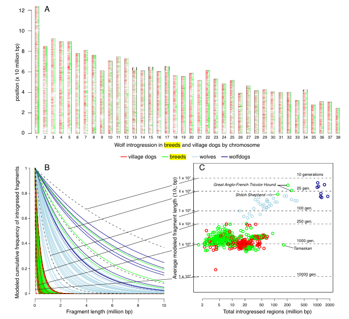

## Intended Learning Outcomes {.c}

- Characterize Poisson, Exponential, and Gamma distribution
- Apply Bayesian priors for Poisson, Exponential, and Gamma distribution

# Observation in a Fixed Time Interval

## Poisson Distribution {.smaller}

The Poisson distribution expresses the probability of a given number of events occurring in a fixed interval of time if these events occur with a known constant mean rate and independently of the time since the last event.

:::{.columns}

:::{.column}
- Support $x \in \mathbb{N}$
- Parameter $\lambda$, arrival rate.
- pmf

:::{.hide}
$$
P( X = x) = \frac{\lambda^x}{x!}\exp(-\lambda)
$$
:::

**Properties**

- Mean $\lambda$
- Variance $\lambda$
:::

:::{.column}

**Analogy**

- Number of cars waiting for traffic lights
- Biological signals (neuron spike, ECG spike)
- Prevalence rate of a disease

:::

:::

## Illustration

```{python}
#| echo: false

import matplotlib.pyplot as plt
import numpy as np
from scipy.stats import poisson
import matplotlib.ticker as ticker

def plot_poisson_pmf(lambdas, max_multiplier=5):
    """
    Plot the PMF of Poisson distributions for different lambda values.
    
    Parameters:
    - lambdas: list of floats, different lambda values (mean and variance)
    - max_multiplier: int, multiplier for max_k to truncate the plot (default 5)
    """
    fig, axs = plt.subplots(1, len(lambdas), figsize=(12, 4), sharey=True)
    fig.suptitle('Poisson Distribution PMF for Different λ')
    
    for j, lam in enumerate(lambdas):
        # Mean and variance are both lambda
        mean = lam
        var = lam
        max_k = int(mean + max_multiplier * np.sqrt(var))
        
        # k values
        k = np.arange(0, max_k + 1)
        # PMF values
        pmf = poisson.pmf(k, lam)
        
        # Plot as bar chart
        axs[j].bar(k, pmf, alpha=0.7)
        axs[j].set_title(f'λ={lam}')
        axs[j].set_xlabel('k (number of events)')
        if j == 0:
            axs[j].set_ylabel('Probability')
        
        # Adjust xticks to only show at integers
        axs[j].xaxis.set_major_locator(ticker.MaxNLocator(integer=True))
    
    plt.tight_layout()
    plt.show()

# Example usage
if __name__ == "__main__":
    lambdas = [1, 5, 10]  # Different lambda values
    plot_poisson_pmf(lambdas)
```

## Binomial Distribution Approximates Poisson Distribution {.smaller}

When $n \rightarrow \infty$ and $p \rightarrow 0$, the Binomial distribution approximates the Poisson distribution. In this case, $\lambda = np$. (*Proofs is in the tutorial question*)


**Implication**

- $n \rightarrow \infty$, and $p \rightarrow 0$ implies rare event for Poisson distribution
- Rule of thumb: $n \geq 100$ and $np \leq 10$

## Illustration

```{python}
#| echo: false

import matplotlib.pyplot as plt
import numpy as np
from scipy.stats import binom, poisson
import matplotlib.ticker as ticker

def plot_binomial_poisson_approximation(lam, ns, max_multiplier=5):
    """
    Plot the PMF of binomial distributions for different n (with p = lambda/n) 
    and overlay the Poisson PMF to illustrate the approximation.
    
    Parameters:
    - lam: float, fixed mean lambda for Poisson and np for binomial
    - ns: list of integers, different number of trials n (increasing)
    - max_multiplier: int, multiplier for max_k to truncate the plot (default 5)
    """
    # Determine max_k based on Poisson
    mean = lam
    var = lam
    max_k = int(mean + max_multiplier * np.sqrt(var))
    
    # k values
    k = np.arange(0, max_k + 1)
    
    # Poisson PMF
    pmf_poisson = poisson.pmf(k, lam)
    
    fig, axs = plt.subplots(1, len(ns), figsize=(12, 4), sharey=True)
    fig.suptitle(f'Binomial Approximation to Poisson (λ={lam}) for Increasing n')
    
    for j, n in enumerate(ns):
        p = lam / n
        # Binomial PMF
        pmf_binom = binom.pmf(k, n, p)
        
        # Plot binomial as bars
        axs[j].bar(k, pmf_binom, alpha=0.5, label='Binomial')
        # Plot Poisson as stems (or bars)
        axs[j].bar(k, pmf_poisson, alpha=0.5,  label='Poisson')
        
        axs[j].set_title(f'n={n}, p={p:.3f}')
        axs[j].set_xlabel('k (number of events/successes)')
        if j == 0:
            axs[j].set_ylabel('Probability')
        axs[j].legend()
        
        # Adjust xticks to only show at integers
        axs[j].xaxis.set_major_locator(ticker.MaxNLocator(integer=True))
    
    plt.tight_layout()
    plt.show()

# Example usage
if __name__ == "__main__":
    lam = 5  # Fixed lambda
    ns = [10, 100, 1000]  # Increasing n
    plot_binomial_poisson_approximation(lam, ns)
```


## Negative Binomial Distribution Approximates Poisson Distribution {.smaller}

When $r \rightarrow \infty$ and $p \rightarrow 0$, the Negative Binomial distribution approximates the Poisson distribution. (*Proofs is in the tutorial question*)

**Implication**

- $r \rightarrow \infty$ implies rare event to call a stop
- Rule of thembs: $r \geq 10$ and $rp \leq 10$


In practice, the negative binomial distribution is more popular than Poisson distribution 


## Illustration

```{python}
#| echo: false

import matplotlib.pyplot as plt
import numpy as np
from scipy.stats import nbinom, poisson
import matplotlib.ticker as ticker

def plot_negative_binomial_poisson_approximation(lam, rs, max_multiplier=5):
    """
    Plot the PMF of negative binomial distributions for different r (with p = r/(r + lambda)) 
    and overlay the Poisson PMF to illustrate the approximation.
    
    Parameters:
    - lam: float, fixed mean lambda for Poisson and r(1-p)/p for negative binomial
    - rs: list of integers, different number of successes r (increasing)
    - max_multiplier: int, multiplier for max_k to truncate the plot (default 5)
    """
    # Determine max_k based on Poisson
    mean = lam
    var = lam
    max_k = int(mean + max_multiplier * np.sqrt(var))
    
    # k values
    k = np.arange(0, max_k + 1)
    
    # Poisson PMF
    pmf_poisson = poisson.pmf(k, lam)
    
    fig, axs = plt.subplots(1, len(rs), figsize=(12, 4), sharey=True)
    fig.suptitle(f'Negative Binomial Approximation to Poisson (λ={lam}) for Increasing r')
    
    for j, r in enumerate(rs):
        p = r / (r + lam)
        # Negative Binomial PMF (number of failures k)
        pmf_nbinom = nbinom.pmf(k, r, p)
        
        # Plot negative binomial as bars
        axs[j].bar(k, pmf_nbinom, alpha=0.5, label='Negative Binomial')
        # Plot Poisson as stems
        axs[j].bar(k, pmf_poisson, alpha=0.5, label='Poisson')
        
        axs[j].set_title(f'r={r}, p={p:.3f}')
        axs[j].set_xlabel('k (number of failures/events)')
        if j == 0:
            axs[j].set_ylabel('Probability')
        axs[j].legend()
        
        # Adjust xticks to only show at integers
        axs[j].xaxis.set_major_locator(ticker.MaxNLocator(integer=True))
    
    plt.tight_layout()
    plt.show()

# Example usage
if __name__ == "__main__":
    lam = 5  # Fixed lambda
    rs = [1, 10, 100]  # Increasing r
    plot_negative_binomial_poisson_approximation(lam, rs)
```

# Observation in a Fixed Count

## Exponential Distribution {.smaller}

A random variable describing the time (or distance) between two Poisson arrivals.
If $X$ is an event count that follows $X \sim \text{Poisson}\left( \mu \right)$, then the time $T$ between events follows $T \sim \text{Exponential}( \frac{1}{\mu})$.
 
:::{.columns}
 
:::{.column}

**Properties**

- Support $x > 0$
- Parameter $\lambda$, arrival rate.
- pdf

:::{.hide}
$$
f_X( x ) = \lambda e^{-\lambda x}
$$
:::

- Mean $\text{E}(X) = \frac{1}{\lambda}$
- Variance $\text{V}(X) = \frac{1}{\lambda^2}$

:::
 
:::{.column}

**Example**

- Waiting time for the next bus if arrivals are Poisson
- Waiting time for developing cancer after exposure 

:::
 
:::

## Example in population genetics {.smaller}

Our dog is dog or wolf @lin2025legacy

- Traaditional theory think dog (Canis lupus familiaris) and wolf (Canis lupus) are two differnet species (i.e Monophyly)

:::{.columns}

:::{.column}

- Recent study shows that from a wild range of village dogs gene we can almost reconstruct a wolf's gene
- Wolf's gene are just fragmented in dogs gene depends on species
- Based on the fragmented size  we can estimate how long does it happened (i.e. small fragmented means happened in long time ago)
:::

:::{.column}

{width=80%}

:::

:::

# Conjugate Prior

## Gamma Distribution {.smaller}

Let $x_1,\dots x_n$ be i.i.d random variables from an exponential distribution $\lambda$, then $\sum_{i=1}^nx_n \sim \text{Gamma}(n, n\lambda)$.
Gamma distribution can be used to describe  time elapsing until the accumulation of a specific number of unpredictable events.


:::{.columns}

:::{.column}

**Properties**

- Support $x \in \mathbb{R}$
- Parameters $\alpha, \lambda$
- pdf

:::{.hide}
$$
f_X\left( x \right) 
= \frac{\lambda^\alpha}{\Gamma(\alpha)} x^{\alpha - 1} e^{-\lambda x} ,
$$
:::

:::

:::{.column}

1. It is clear that $\text{Gamma}(1,\lambda)\sim \text{EXP}(\lambda)$
2. Measurement on time and count.[^1]
   - $X\sim\text{Gamma}(\alpha,\lambda)$, and $Y\sim\text{Pois}(x\lambda)$
   - $P(X>x) =P(Y<\alpha)$
  
[^1]: An example is that we describe the time to see a bus, so the probability of waiting for more than $x$ minutes is equivalent to the probability of seeing no bus in $x$ minutes.

:::

:::

## Poisson Distribution with Gamma Distribution Prior {.smaller}

The Gamma distribution is a conjugate prior to the Poisson distribution. Let's say we have $n$ observations $x_1, \dots x_n$ from an unknown Poisson distribution, and we assume the prior probability of $\lambda \sim \text{Gamma}(\alpha,\beta)$. The posterior estimation of parameter $\lambda$

:::{.hide}
$$
\begin{align}
p(\lambda\mid x_1\dots x_i) \propto & \quad p( x_1\dots x_i \mid\lambda)\text{Gamma}(\alpha,\beta) \\ \propto & \quad
e^{-n\lambda}\lambda^{\sum x_i}\lambda^{\alpha-1}e^{-\beta\lambda} \\ \propto & \quad
\lambda^{\alpha+\sum x_i-1}e^{-(n+\beta)\lambda}
\end{align}
$$
:::

The posterior distribution: <span class="hide">$\lambda \sim \text{Gamma}(\alpha+\sum x_i,\beta+n)$</span>

**Analogy**

Adding pseudo Poisson observations with total $\alpha$ occurrences in the $\beta$ time intervals. 

## Illustration {.smaller}
```{python}
#| echo: false

import numpy as np
import matplotlib.pyplot as plt
from scipy.stats import gamma

# 1. Define Data: Observed counts
data = np.array([2, 5, 3, 4])
n = len(data)
sum_x = np.sum(data)
mle = sum_x / n  # MLE = 14/4 = 3.5

# 2. Define Priors (Gamma parameters: alpha, beta)
priors = [
    {'name': 'Weak/Broad Prior', 'alpha': 1.0, 'beta': 0.1},
    {'name': 'Informative (Matching)', 'alpha': 14.0, 'beta': 4.0},
    {'name': 'Informative (Biased)', 'alpha': 20.0, 'beta': 2.0}
]

# X-axis for lambda (rate parameter)
x = np.linspace(0, 14, 1000)

fig, axes = plt.subplots(1, 3, figsize=(18, 5))

for i, p in enumerate(priors):
    ax = axes[i]
    # Prior Parameters
    a_prior, b_prior = p['alpha'], p['beta']
    
    # Posterior Parameters: alpha + sum(x), beta + n
    a_post = a_prior + sum_x
    b_post = b_prior + n
    
    # Calculate PDFs (scipy uses scale = 1/beta)
    y_prior = gamma.pdf(x, a_prior, scale=1/b_prior)
    y_post = gamma.pdf(x, a_post, scale=1/b_post)
    
    # Likelihood (Normalized for visualization as Gamma(sum_x+1, n))
    y_like = gamma.pdf(x, sum_x + 1, scale=1/n)
    
    # Plot
    ax.plot(x, y_prior, 'g--', linewidth=2, label=f'Prior $\\alpha={a_prior:.1f}, \\beta={b_prior:.1f}$')
    ax.fill_between(x, y_like, color='gray', alpha=0.3, label='Likelihood (Data)')
    ax.plot(x, y_post, 'b-', linewidth=3, label=f'Posterior  $\\alpha={a_post:.1f}, \\beta={b_post:.1f}$')
    
    # Mark MLE
    ax.axvline(mle, color='k', linestyle=':', label=f'MLE={mle:.1f}')
    
    ax.set_title(p['name'])
    ax.set_xlabel(r'$\lambda$ (Rate)')
    if i == 0: ax.set_ylabel('Density')
    ax.legend()
    ax.grid(alpha=0.3)

plt.suptitle(f'Gamma-Poisson Bayesian Update (Data: {list(map(str,data))})', fontsize=16)
plt.tight_layout()
```

## Posterior predictive distribution {.smaller}

The posterior predicitive distribution of $p(\tilde{x}|\text{data})$ follows Negative binomial distribution

```{python}
#| echo: false

import numpy as np
import matplotlib.pyplot as plt
from scipy.stats import nbinom

# 1. Define Data
data = np.array([2, 5, 3, 4])
n_data = len(data)
sum_x = np.sum(data)

# 2. Define Priors
priors = [
    {'name': 'Weak Prior', 'alpha': 1.0, 'beta': 0.1},
    {'name': 'Matching Prior', 'alpha': 14.0, 'beta': 4.0},
    {'name': 'Biased Prior', 'alpha': 20.0, 'beta': 2.0}
]

# Grid setup
fig, axes = plt.subplots(1, 3, figsize=(10, 3))
x_counts = np.arange(0, 20)  # Discrete range for counts

for i, p in enumerate(priors):
    ax = axes[i]
    
    # Parameters
    prior_a, prior_b = p['alpha'], p['beta']
    post_a = prior_a + sum_x
    post_b = prior_b + n_data
    
    # 1. Observed Data (Normalized Histogram)
    obs_counts = np.bincount(data, minlength=len(x_counts))
    obs_freq = obs_counts / n_data
    obs_freq = obs_freq[:len(x_counts)]
    
    # 2. Prior Predictive (Negative Binomial)
    # n = alpha, p = beta / (beta + 1)
    pp_n = prior_a
    pp_p = prior_b / (prior_b + 1)
    pmf_prior_pred = nbinom.pmf(x_counts, pp_n, pp_p)
    
    # 3. Posterior Predictive (Negative Binomial)
    post_n = post_a
    post_p = post_b / (post_b + 1)
    pmf_post_pred = nbinom.pmf(x_counts, post_n, post_p)
    
    # Plotting
    width = 0.35
    
    # Bar 1: Observed Data
    ax.bar(x_counts - width/2, obs_freq, width=width, color='gray', alpha=0.4, label='Observed Data')
    
    # Bar 2: Posterior Predictive (Distinct Color)
    ax.bar(x_counts + width/2, pmf_post_pred, width=width, color='#3498db', alpha=0.9, label='Posterior Predictive')
    
    # Line: Prior Predictive
    ax.plot(x_counts, pmf_prior_pred, color='green', linestyle='--', marker='o', markersize=4, label='Prior')
    
    ax.set_title(f"Predictive Distribution\n({p['name']})")
    ax.set_xlabel('Count (x)')
    if i == 0:
        ax.set_ylabel('Probability')
        ax.legend(loc='upper right')
    
    ax.grid(axis='y', linestyle=':', alpha=0.3)

plt.suptitle('Bayesian Update: Posterior Predictive Distributions', fontsize=16)
plt.tight_layout(rect=[0, 0, 1, 0.95])
```

The prove is trivial, but the takeaway is

- Negative binomial distribution can be seen as a Poisson with prior distribution
- Relaxation on variance
- Relatxation comes form the uncertainty of $\lambda$
- Zero-inflated data


## Exponential Distribution with Gamma Distribution Prior {.smaller}

Let's say we have $n$ observations $x_1, \dots x_n$ from an unknown Exponential distribution, and we assume the prior probability of $\lambda \sim \text{Gamma}(\alpha,\beta)$. The posterior estimation of parameter $\lambda$

:::{.hide}
$$
\begin{align}
p(\lambda\mid x_1\dots x_i) \propto & \quad p( x_1\dots x_i \mid\lambda)\text{Gamma}(\alpha,\beta) \\ \propto & \quad
\lambda^n e^{-\lambda \sum x_i }\lambda^{\alpha-1}e^{-\lambda\beta}\\ 
= & \quad
\lambda^{n+\alpha-1}e^{-(\sum x_i+\beta)\lambda}
\end{align}
$$
:::

Posterior distribution: $\text{Gamma}(n+\alpha,\sum x_i +\beta)$

**Analogy**

Adding pseudo observations with total $\alpha$ observations over total time $\beta$

## Illustration


```{python}
#| echo: false

import numpy as np
import matplotlib.pyplot as plt
from scipy.stats import gamma

# 1. Define Data
# Synthetic data: n=5, sum(x)=2.5 -> MLE = 5/2.5 = 2.0
data_points = np.array([0.5, 0.4, 0.6, 0.5, 0.5]) 
n = len(data_points)
sum_x = np.sum(data_points)
mle = n / sum_x  # MLE for exponential rate lambda

# 2. Define Priors (Gamma parameters: alpha, beta)
priors = [
    {'name': 'Weak/Broad Prior', 'alpha': 1.0, 'beta': 0.1},
    {'name': 'Informative (Matching)', 'alpha': 4.0, 'beta': 2.0},
    {'name': 'Informative (Biased)', 'alpha': 10.0, 'beta': 2.0}
]

# X-axis for lambda
x_axis = np.linspace(0, 8, 1000)

fig, axes = plt.subplots(1, 3, figsize=(18, 6))

for i, p in enumerate(priors):
    ax = axes[i]
    
    # Prior Parameters
    prior_a, prior_b = p['alpha'], p['beta']
    
    # Posterior Parameters (Gamma conjugate update for Exponential)
    # alpha_new = alpha + n
    # beta_new = beta + sum(x)
    post_a = prior_a + n
    post_b = prior_b + sum_x
    
    # Calculate PDFs (scipy uses scale = 1/beta)
    y_prior = gamma.pdf(x_axis, prior_a, scale=1.0/prior_b)
    y_post = gamma.pdf(x_axis, post_a, scale=1.0/post_b)
    
    # Likelihood (Normalized to integrate to 1 for comparison)
    # Shape is Gamma(n+1, sum(x))
    y_like = gamma.pdf(x_axis, n + 1, scale=1.0/sum_x)
    
    # Plotting
    ax.plot(x_axis, y_prior, 'g--', lw=2,  label=f'Prior $\\alpha={a_prior:.1f}, \\beta={b_prior:.1f}$')
    ax.fill_between(x_axis, y_like, color='gray', alpha=0.2, label='Likelihood (Data)')
    ax.plot(x_axis, y_post, 'b-', lw=3,label=f'Posterior  $\\alpha={a_post:.1f}, \\beta={b_post:.1f}$')
    
    # MLE Line
    ax.axvline(mle, color='k', linestyle=':', label=f'MLE={mle:.1f}')
    
    ax.set_title(p['name'])
    ax.set_xlabel(r'$\lambda$ (Rate)')
    if i == 0: ax.set_ylabel('Density')
    ax.legend()
    ax.grid(alpha=0.3)

plt.suptitle(f'Gamma-Exponential Bayesian Update (n={n}, sum(x)={sum_x:.1f})', fontsize=16)
plt.tight_layout(rect=[0, 0.03, 1, 0.95])
```

## Quick Review {.smaller}

```{dot}
digraph G {
   node [label="Binomial(n,p)" fontsize="12"] bin;
   node [label="Bernoulli(p)" fontsize="12"] ber;
   node [label="Poisson(λ)" fontsize="12"] pos;
   node [label="Hypergeometric(M,N,K)" fontsize="12"] hyp;
   node [label="Negative Binomial(n,p)" fontsize="12"] nb;
   node [label="Geometric(p)" fontsize="12"] geo;
   node [label="Gamma(r,λ)" fontsize="12"] gam;
   node [label="Beta(α,β)" fontsize="12"] bet;
   node [label="Exponential(λ)" fontsize="12"] exp;
   bin -> pos [label="λ=np, n→∞" fontsize="12"];
   bin -> ber [label="n=1" fontsize="12"];
   ber -> bin [label="Σx" fontsize="12"];
   hyp -> bin [label="p=M/N, n=k, N→∞" fontsize="12"];
   nb -> pos [label="λ=n(1-p), n→∞" fontsize="12"];
   geo -> nb [label="Σx" fontsize="12"];
   nb -> geo [label="n=1" fontsize="12"];
   gam -> exp [label="r=1" fontsize="12"];
   bet -> gam [label="nX, n→∞" fontsize="12"];
   exp -> gam [label="Σx" fontsize="12"];
   bet -> ber [color="#FF0000"];
   bet -> nb [color="#FF0000"];
   bet -> bin [color="#FF0000"];
   bet -> geo [color="#FF0000"];
   gam -> pos [color="#FF0000"];
   gam -> exp [color="#FF0000"];
   gam -> gam [label="known α" color="#FF0000"];

}
```

## Quick Review {.smaller}

| Distribution | Parameter | Conjugate Prior | Posterior Hyperparameters | Posterior Predictive |
| ------------ | --------- |---------------- | ------------------------- | -------------------- |
| Bernoulli | $p$ | $\small\text{Beta}(\alpha,\beta)$ | $\small\begin{aligned}\alpha' = \alpha+\sum x_i, \\ \beta'=\beta+n-\sum x_i\end{aligned}$ | $\small\text{Bern}(\frac{\alpha'}{\alpha'+\beta'})$ |
| Binomial | $p$ | $\small\text{Beta}(\alpha,\beta)$ | $\small\begin{aligned}\alpha' = \alpha+\sum x_i, \\ \beta'=\beta+\sum n-\sum x_i\end{aligned}$ | $\small\text{Beta-binomial}(\alpha',\beta')$ |
| Negative Binomial | $p$ | $\small\text{Beta}(\alpha,\beta)$ | $\small\begin{aligned}\alpha' = \alpha+rn, \\ \beta'=\beta+\sum x_i\end{aligned}$ |  |
| Geometric | $p$ | $\small\text{Beta}(\alpha,\beta)$ | $\small\begin{aligned}\alpha' = \alpha+n, \\ \beta'=\beta+\sum x_i\end{aligned}$ |  |

## Quick Review {.smaller}

| Distribution | Parameter | Conjugate Prior | Posterior Hyperparameters | Posterior Predictive |
| ------------ | --------- |---------------- | ------------------------- | -------------------- |
| Poisson | $\lambda$ | $\small\text{Gamma}(\alpha,\beta)$ | $\small\begin{aligned}\alpha' = \alpha+\sum x_i, \\ \beta'=\beta+n\end{aligned}$ | $\small\text{NB}(\alpha',\frac{\beta'}{1+\beta'})$  |
| Exponential | $\lambda$ | $\small\text{Gamma}(\alpha,\beta)$ | $\small\begin{aligned}\alpha' = \alpha+n, \\ \beta'=\beta+\sum x_i\end{aligned}$  | $\small\frac{\beta'}{\alpha'}(1+\frac{x}{\alpha'})^{-\beta'-1}$ |

## Bibilography notes