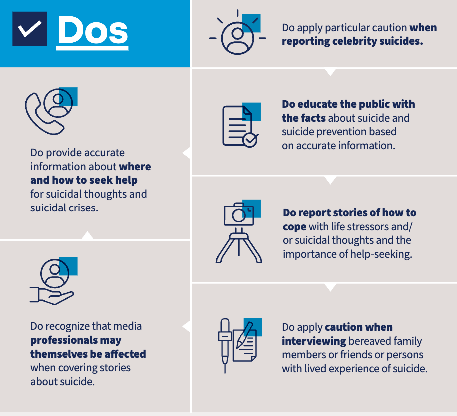
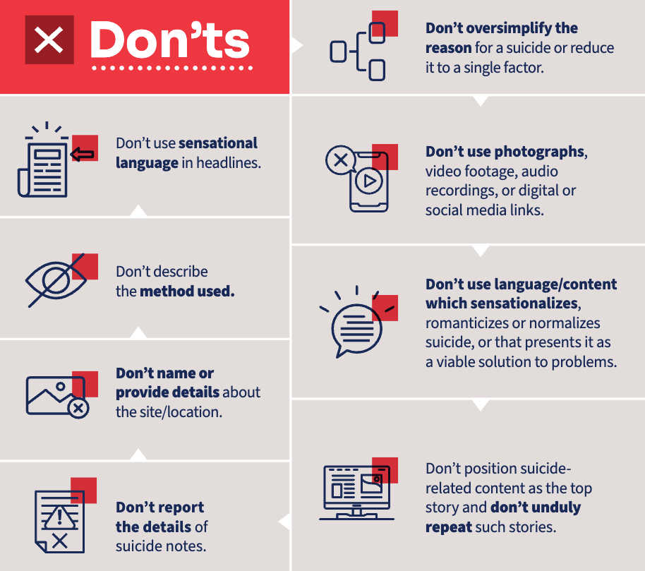
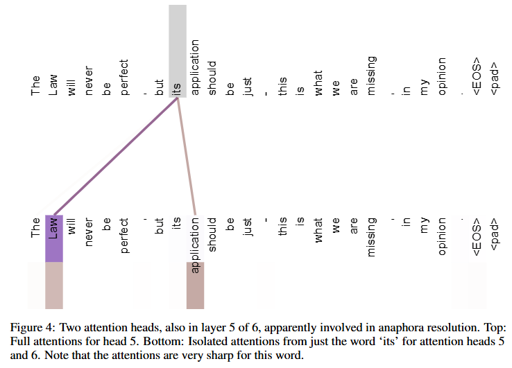
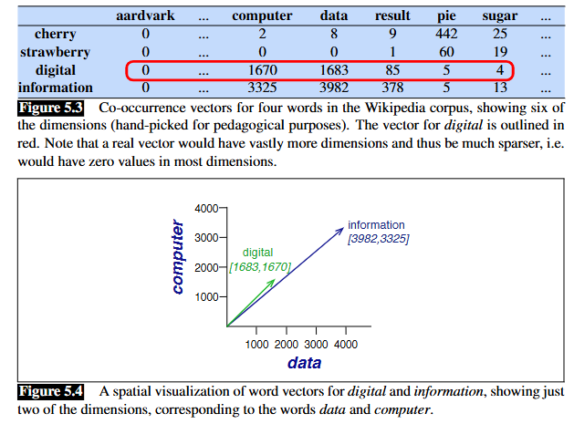
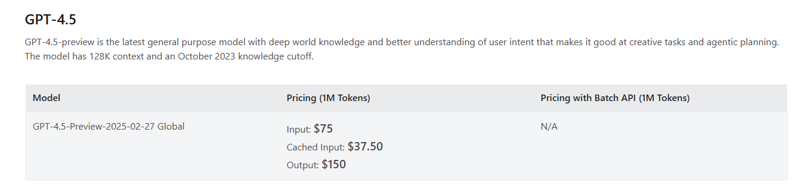
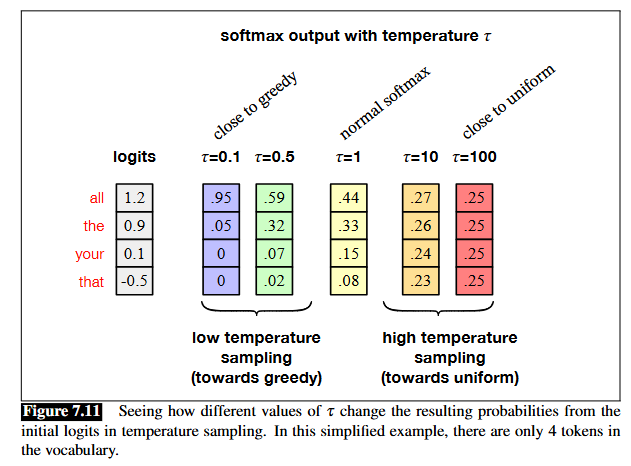
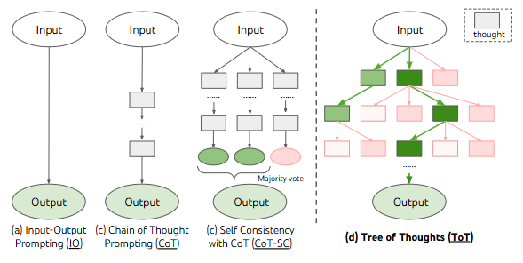

## Overview {.smaller}
- **Project Task**
- **Project Background**
    - Suicide
    - Suicide reporting and its impact
- **Key Technical Skills**
    - Overview of natural language processing
    - Large language model (LLM)
    - Instructing LLM
    - Chain of thought

<!-- ## Acknowledgement

- This project-based learning deck is made in collaboration with HKJC Centre for Suicide Research and Prevention under JC Early Warning System -->


# Project task{background-color="white" background-image="Image/new_idea.jpg" background-size="auto auto" background-position="top 0px right 0px"}

## Project task

> Does a machine learning model have the potential to evaluate suicide news reports?

- **Specific Tasks**
 1. Coding Hong Kong local suicide news reports
 2. Developing an LLM prompt to examine whether an LLM can evaluate suicide news reporting style


# Suicide


## Suicide {.smaller}

- **Global Statistics**  
  - ~800,000 deaths annually (WHO, 2023)
  - Suicide is the 4th leading cause of death among 15-29-year-olds  
- **Ideation-to-Action Framework**
  
  @klonsky2015three proposed the framework from ideation (suicidal thoughts) to action (behaviors).

- **Key Risk Factors**  
  - Psychological factors: Depression, Schizophrenia  
  - Socioeconomic factors: Relationships, access to lethal means
  - Biological factors: Cancer

## Biological perspective of suicide

- **Control of Impulsive Behavior**
    - Associated with the prefrontal cortex [@mann2002current].

- **Heritability**
    - Twin studies show a 0.2~0.45 concordance rate for suicidal behavior [@pedersen2010genetic].

## Implications for suicide prevention

From a population-level perspective, interventions targeting the whole community usually focus on the following aspects:

1. Means control
2. Health promotion

::: {.callout-tip}
## Discussion

Have you seen any suicide prevention efforts in your daily life?

:::

# Overview of suicide in Hong Kong


## Suicide rate in Hong Kong

:::: {.columns}

::: {.column width="40%" .smaller}
- Hong Kong's age-standardized suicide rate: 9.5 per 100,000 people
- The historical peak was in 2003 during the SARS outbreak and financial crisis
- Heterogeneity within subgroups
:::

::: {.column width="60%"}
{ width="100%"}
:::

::::

# Media Reporting on Suicide { background-color="white" background-image="Image/interview.jpg" background-size="auto auto" background-position="top 0px right 0px"}


## Media Impact on suicide
- **Arguments on Media Effects**

Media reporting can influence suicidal behavior through imitation, protection, or neutrality.

There are arguments about different effects:

- Papageno effect (Positive effect)
- No effect
- Werther effect (Negative effect)

## Papageno effect {.smaller}

- **Definition**
Media stories of coping, hope, and recovery can reduce suicidal ideation and encourage help-seeking.

- **Evidence**
    - @niederkrotenthaler2010role 
        - Short-term decrease in suicides 
        - Reporting with coping and encouraging content
    - @carmichael2019media
        - Reporting with treatment information

- **Counterarguments**
A systematic review [@sisask2012media] does not confirm the effect.

## Werther effect

- **Definition**
Increased suicides following detailed, sensationalist media reports, especially of celebrities. This promotes imitation via social learning theory.

- **Evidence**
    - Promoting suicide methods:
      @chan2005charcoal, @yip2022social
    - Imitating celebrities: 
      @hegerl2013one, @yip2006effects 

## Debating on the Effects

- **What is the Effect?**
    - Can we establish a causal relationship between `media reporting` and `suicide`?
    - Individual studies show positive/negative effects, but what then?

::: {.callout-tip}
## Discussion

- Have you read any local suicide news?
- What did you feel after reading it?
- What have you learned from the news?

:::

# Responsible reporting style

## WHO guidelines on ethical reporting

The news media's impact on suicide depends on how it is reported. A responsible reporting style is needed.

- @world2023preventing developed guidelines for good reporting styles.

## Dos {.smaller}

:::: {.columns}

::: {.column width="55%"}
- Provide
    - helpful information
    - facts on suicide and prevention efforts
- Acknowledge that reporters may be affected
- Report how to cope and seek help
- Exercise caution with
    - Celebrity suicides
    - Interviewing bereaved family and friends
:::

::: {.column width="45%"}
{ width="100%"}
:::

::::


## Don'ts {.smaller}


:::: {.columns}

::: {.column width="55%"}
- Content
    - Methods
    - Details
- Style
    - Over-simplifying reasons
- Language use
    - Sensational language
    - Romanticizing
- Additional content
    - Visual and audio content
    - Social media links
:::

::: {.column width="45%"}
{ width="100%"}
:::

::::

## Assessing the Quality of News Reporting 

- @john2014printqual developed a scale (PRINTQUAL) to quantitatively evaluate the quality of reporting suicide news
- @jarvis2025development proposed a web version for online news reporting
- Challenges in the online media year
  - Different modality
  - Social media
  - Comment threads

# Natural language processing

## Natural language processing{.smaller}

:::: {.columns}

::: {.column width="50%"}
**Definition** A field using computers to understand and analyze human languages.

You might also hear the term **computational linguistics**, which uses quantitative approaches to study human linguistics, and most of the time both terms are interchangeable. 

::: {.callout-tip}
## Discussion

If a natural language processing task can fall into a traditional (or even deep learning) scope, then why is it so special that it is usually discussed separately?

:::
:::

::: {.column width="50%"}
**Scope of NLP** We can still use machine learning taxonomy to categorize tasks:

- *Unsupervised learning*
    - Encoding language
    - Ranking/Searching documents
- *Supervised learning*
    - Classification of parts of speech, sentiment, etc.
- *Generative models*
    - Machine translation
    - Text-to-speech
    - Chatbots

:::

::::

## Why modeling text is so different

:::: {.columns}

::: {.column width="60%"}
- Modeling perspective
  - Dynamic input shape
  - Context awareness
  - Training time
  - Evaluation
- Data perspective
  - Ambiguity
  - Dirty data
:::

::: {.column width="40%"}
For the rest of the slides, we will discuss NLP in these three aspects

1. Data processing
2. Modeling
3. Evaluation
:::

::::


## Our whole universe was in a regression {.smaller}

We start from a regression setting, and we define the input and outcome pair $(x_i,y_i)$ with total $n$ observations, where 

- $x_i = [x_{i1}\dots x_{ip}]$ : feature vectors with size $p$, and
- $y_i$ : outcome vectors:
  - $y_i \in [0,1] \rightarrow$ Logistic regression, other classification methods 
    - Sentiment analysis
    - Spam detection
    - Language Identification
  - $y_i \in \mathbb{R} \rightarrow$ other GLMs
    - Product rating

## Fantastic Features and where to find them {.smaller}

An intuitive way is to set the p-th  feature of document i as

$$\begin{align*} 
x_{ip}  
        & = 1 \text{ if the i-th document contains word "XXXX"} \\
        & = 0 \text{ if the i-th document does not contain word "XXXX"} 
\end{align*}
$$

There are also other alternatives

$$\begin{align*} 
x_{ip} \in \mathbb{Z} \text{ How many times that "XXXX" occurs in the document i  }
\end{align*}
$$

::: {.callout-tip}
## Discussion

- What is the implied distribution of $x_{ip}$
- What is the limitation of regression approach
:::

## Then neural network expansion started. Wait.. {.smaller}

The key questions at this moment lies  in two aspects

- Understanding the context
  - Recurrent neural network (RNN)
  - Long-short term memory (LSTM)
  - Transformer
  - LLM

- Better feature engineering
    - Autoencoder
    - Multi-layer perceptron(MLP)
    - convolution neural network (CNN)

## Multi-layer perceptron(MLP) {.smaller}

:::: {.columns}

::: {.column width="50%"}
Adjustment of  input

- Treat text as a time-series
$$ 
  \begin{align}
  & x_{ijp} = 1 \text{ if the j-th words in i-th } \\
  & \text{document contains word in index p} 
   \end{align}
$$

- We need to create a dictionary index $\{p:"XXX"\}$
:::

::: {.column width="50%"}

```{mermaid}
stateDiagram 
i : Input text

state i{
T0 : Text A1
T1 : Text A2
}
r : Hidden layers
state r{
RNN1 : Node1
RNN2 : Node2
RNN3 : Node3
RNN4 : Node4

}
o : Output layers

state o{
o1 : Output layer 1
o2 : Output layer 2
}
 T0 --> RNN1
 T1 --> RNN1
 T0 --> RNN2
 T1 --> RNN2
 T0 --> RNN3
 T1 --> RNN3
 T0 --> RNN4
 T1 --> RNN4
 RNN1 --> o1
 RNN2 --> o1
 RNN3 --> o1
 RNN1 --> o2
 RNN2 --> o2
 RNN3 --> o2

```
:::

::::

## RNN and LSTM {.smaller}

:::: {.columns}

::: {.column width="50%"}
- What did MLP and CNN not achieve
  - Context
  - Amount of parameter
- Solution
  - Asking nodes to **memorizing** context
  - Using this **Memory** as an additional input 

:::

::: {.column width="50%"}

```{mermaid}
stateDiagram 
i : Input text

state i{
T0 : Text A1
T1 : Text A2
T2 : Text A3
}
r : Hidden layers
state r{
RNN1 : Node1
RNN2 : Node2
RNN3 : Node3
}
o : Output layers

state o{
o1 : Output layer 1
o2 : Output layer 2
}

 T0 --> RNN1
 T1 --> RNN2
 T2 --> RNN3

 RNN1 --> o1
 RNN2 --> o1
 RNN3 --> o1

 RNN1 --> o2
 RNN2 --> o2
 RNN3 --> o2

 RNN1 --> RNN2
 RNN2 --> RNN3


```

:::

::::

## Attention, transformer and LLM  {.smaller}

:::: {.columns}

::: {.column width="60%"}
- **Attention mechanism** introduced in @vaswani2017attention *Attention is All You Need*, which uses self-attention mechanisms to process input data efficiently.

{ height="300px"}


:::

::: {.column width="40%"}
- Instead of memorizing previous state, attention mechanism dynamically calculates the importance of each input based on the context.

```{mermaid}
stateDiagram 
i : Input text

state i{
T0 : Text A1
T1 : Text A2
T2 : Text A3
}

e : Embedding
state e {

Query1 : Query A1
Key1 : Key A1 
Key2 : Key A2
Key3 : Key A3
Value1 : Value A1
Value2 : Value A2
Value3 : Value A3
}

w : Attention Weight
state w {

weight1 : Weight A1
weight2 : Weight A2
weight3 : Weight A3

}


 T0 --> Query1
 T0 --> Key1
 T0 --> Value1
 T1 --> Key2
 T1 --> Value2
 T2 --> Key3
 T2 --> Value3

  Query1 --> weight1
  Key1 --> weight1

  Query1 --> weight2
  Key2 --> weight2

  Query1 --> weight3
  Key3 --> weight3

  weight1 --> output
  Value1 --> output

  weight2 --> output
  Value2 --> output

  weight3 --> output
  Value3 --> output

```
:::
::::


## All I need is data {.smaller}

:::: {.columns}

::: {.column width="50%"}
Training an NLP model requires a huge amount of data. For example, OpenAI revealed [@brown2020language] that the majority of the training data sources are English data from:  

- Web pages
- Social media and forum posts
- Books
- Wikipedia
- User feedback (for GPT-4 and onwards)
:::

::: {.column width="50%"}

::: {.callout-tip}
## Discussion

What are the implications of these data sources in terms of

- Performance
- Privacy
:::

:::

::::

## Pre-processing data

At the first step of data analysis, pre-processing is always the key to quality model and better performance.

- Cleaning data
  - Pre-processing issue
- Encoding text into vector space
  - Tokenization
  - Embedding
- Labeling data

## Cleaning data

:::: {.columns}

::: {.column width="60%"}
  - Mannual typo, non-text elements
  - Stopwords
    - Function word (e.g. articles, pronouns, conjunctions, ...)
    - Overly used verb
  - Declension (Tense, gender, plural)
:::

::: {.column width="40%"}

::: {.callout-tip}
## Discussion

- Why can LLM accept our typos? 
- If LLM can comprehend typos, then do I need to clean data?

:::

:::

::::

## Tokenizing text {.smaller}

**Tokenize** means breaking down sentences to small pieces of words

A straight forward way is word tokenization

> New public housing with enlarged toilets and kitchens for the convenience of wheelchair users.
> 
> 新公屋廁廚加大便利輪椅戶


- **Sentence segmentation**
  - **English**: 14 tokens
    -  rule-based could work nearly perfect
  - **Chinese**: ?? tokens
    -  Dynamic programming approach
    -  Deep-learning approach

## Subword Tokenization {.smaller}

:::: {.columns}

::: {.column width="60%"}
Encoding based on the word are potentially prone to

  - Mis-spelling
  - Hard to cater to grammatical variations

**Subword Tokenization**
Breaking word into some smaller subwords, in addition to address above issue

- Higher chance to guess out of dictionary terms

:::

::: {.column width="40%"}
](Image/token.png){ width="100%"}

:::

::::

## Embedding {.smaller}

:::: {.columns}

::: {.column width="50%"}
**Count-based embedding** 

- **Sentence level**: we create a vocabulary (actually token) corpus and create an adjacency matrix $|V|\times |V|$ where
-  Each element $v_{ij}$ means how many times word $i$ and $j$ is next to each other (1-gram)

{height="250px"}
:::

::: {.column width="50%"}
**Word2vec**

Another brutal way is let the machine embedding themselves through self-supervise learning and auto-encoder. 

- Input: Sentence + word
- Output: Word next to them within 2 words


::: {.callout-tip}
## Discussion

It is obvious that these tokens were represented in high dimension and sparse format. What are the potential implication if we directly used these embedding for analysis?

:::


:::

::::

# Large language model

## Why or Why not LLM


::: {.callout-tip}
## Discussion
- If doing a data science job on language is so troublesome, why not just throw away those old fashioned methods and embrace LLM?
:::


## Techniques of customizing LLM

:::: {.columns}

::: {.column width="50%"}
**Count-based embedding** 

1. **Prompting**
   - Instructing LLM the task
2. **Retrieval-Augmented Generation (RAG)**
   - Giving external reference
3. **Fine-tuning**
   - Retraining model

:::

::: {.column width="50%"}

](Image/RAG_fine.png){ width="100%"}
:::

::::

## Consideration of different customization {.smaller}
- **Budget**


- **Scalability**
  Does the model need to be very generalizable
  - Small, precise model v.s. large generalizable model

## Prompt engineering

- **Structured Prompts**
- **Chain-of-Thought (CoT)**
- **Few-Shot**
  - Provide a few examples of compliant/non-compliant news.
- **Divide and Conquer**

## Structured prompt {.smaller}


:::: {.columns}

::: {.column width="50%"}

Overall, structured instruction provides steadier and more reliable outcomes

**Structured prompt**

- Role
- Task
- Context
- Format
  
  **Few-shot learning** 

- Examples
:::

::: {.column width="50%"}

@xu2024mental proposed a structured prompt to address prediction tasks in mental health-related topics using LLMs:

$$
\begin{aligned}
\text{Prompt} = \text{Analyzed text} + \\
\text{Outcome and context} + \text{Question} + \\\text{Constraints}
\end{aligned}
$$

@nori2024medprompt argues that few-shot learning does not always get better results
:::
::::

::: {.callout-tip}
## Discussion
- Why does 
  - structured prompt
  - few-shot learning
  
  usually have better outcome?
:::

## Chain of thought [@wei2022chain] {.smaller}

**Idea**
Provide illustration of how you solve the problem in the prompt to let LLM understand how to tackle the problem

**Prompt without CoT**

<sup><sub>Jane was born on the last day of February in 2020. Today is her 15-year-old birthday in the common law. What is the date tomorrow in MM/DD/YYYY?</sub></sup>

**Prompt with CoT**

<sup><sub>Example question: Jane was born on the last day of February in 2020. Today is her 15-year-old birthday in the common law. What is the date tomorrow in MM/DD/YYYY?
Example Answer: In common law practice, for leap year babies the legal birthday in common years is March 1st, and 2020+15=2035. So today is 03/01/2035 and tomorrow is 03/02/2035
Please answer the following question:
Question: Ray was born on the last day of February in 2016. Today is his 15-year-old birthday in the common law. What is the date tomorrow in MM/DD/YYYY? </sub></sup>

| Method |gpt-4o-mini (version:2024-07-18) | Grok3 | Grok 4 | Standard answer |
|--|--|--|--|--|
| W/ CoT | 03/01/2035 | 09/03/2025 | 03/02/2035 | 03/02/2035 |
| CoT |  03/02/2031 |  03/02/2031 |  03/02/2031 |  03/02/2031 |

## How does text being generated from LLM {.smaller}

- **Greedy decoding** - local optimal strategy

Choose the highest token ($w_t$) given input $\textbf{w}_{<t}$ (the prompt and your previous output)

$$
\hat{w_t} = \arg\max_{w \in V} P(w | \textbf{w}_{<t})
$$

- **Random sampling** - probabilistic approach

Instead of returning optimal solution, we allow the flexibility of generation through probability sampling. 

$$
w_{t+1} \sim P(w_{t+1} | \textbf{w}_{<t})
$$

::: {.callout-tip}
## Discussion

Neither greedy decoding nor random sampling was used in LLM, what are the disadvantages of these algorithms
:::

## Temperature sampling{.smaller}


:::: {.columns}

::: {.column width="50%"}
- Adjusting the chance of being selected in the random sampling.

Recalling $w \sim \text{Mult}(1,p)$

Therefore, we can using a bayesian to influence this distribution.

-  Some thoughts
   -  Uniform dirichlet prior => It will be normalized at the end
   -  Informative prior => how to generate informative prior?

**Solution**: Exponentially scaling the logit with factor $\frac{1}{\tau}$ 

:::

::: {.column width="50%"}


:::

::::

## Top-p and Top-K sampling {.smaller}

:::: {.columns}

::: {.column width="50%"}

**Top-K**

Random sampling based on the first  $K$ tokens

1. Identifying the $K$ highest probability tokens
2. Drawing samples from these K tokens proportional to their probability

:::

::: {.column width="50%"}
**Top-p**

Random sampling based on the cumulative distribution

1. Identifying the highest $n$ probability tokens that their cumulative probability is less than $p$
2. Drawing samples from these $n$ tokens proportional to their probability

:::

::::

## Self-consistency CoT and Tree of Thought (ToT) {.smaller}


:::: {.columns}

::: {.column width="40%"}

**Self-consistency CoT** @wang2022self
*Random forest of LLM*

1. Generate more possible outcomes 
2. Majority voting of the results

:::

::: {.column width="60%"}
**Tree of Thought** @yao2023tree
*Decision tree*

1. LLM decomposes the task into several strategies and develops strategies
2. Evaluating the output whether it has answered the original question 
:::

::::



# Evaluation and implementation

## Evaluating NLP model performance {.smaller}

Evaluation of NLP largely depends on the task itself. The overall idea is modifying the problem back to MLE/classification-like evaluation 

:::: {.columns}

::: {.column width="50%"}
**Commonly seen indicators**

- Classification and regression task
  - Traditional metrics
- Machine translation
  - Bilingual evaluation understudy (BLEU) score
- Generation
  - Perplexity
- Summarization
  - ROUGE-N
:::

::: {.column width="50%"}
**Perplexity**

*Idea*: Model $\theta$ has the highest probability to get the (i.e. $\arg\max_{\theta} p_{\theta}(w_{1:n})$)

*Issue*: MLE approach subject to the length of a text, and in favor of short text

*Modification*: Perplexity function (Geometric mean of the probability)

$$
\text{Perplexity}_{\theta}(w_{1:n})=\Biggl(\prod_{i=1}^n\frac{1}{P_{\theta}(w_i|w_{<i})}\Biggr)^{(1/n)}
$$

:::

::::

## Implementing NLP task {.smaller}

::: {.callout-tip}
## Discussion
What are the consideration of selecting model to address your NLP task?
:::

. . .

- Output complexity
  -  Classification, regression problem
  -  Generation tasks
- Input complexity
  - Scope of the input text
  - Domain knowledge involved
- Data availability
  - Amount of available data
- Cost
  - Financial feasibility
  - Time feasibility

## Ethical and Safety Issues {.smaller}

:::: {.columns}

::: {.column width="50%"}
**Bias**

Data source is the major contributor of the model bias. The model gets the inference based on your input text, which could convey social and cultural bias.

**Hallucination**

It is prominent in LLM that it generates text based on a probabilistic way instead of facts and references. It can create new things that do not exist at all.

**Safety use**

Sensitive content, violence, sex, death, could occur if you intentionally instruct them to do so. Safely using these tools is critical

:::

::: {.column width="50%"}

:::

::::


## Bibliography {.smaller}
