## Learning Objectives {background-image="img/global health informatics/clo.jpg" background-size="40% 100%" background-position="left"}

:::: {.columns}

::: {.column width="40%"}

:::

::: {.column width="60%"}
- Understand the principles of global health informatics
  - Explore applications in healthcare
  - Identify challenges in implementation
- Recognize key data sources for global health
- Learn effective data presentation and visualization techniques
:::

::::

## What is Global Health Informatics? {.smaller}

:::: {.columns}

::: {.column width="50%"}
- **Health Informatics**: An interdisciplinary field combining health sciences, information technology, and data analytics to improve health equity worldwide [@nihNationalInformation].

:::

::: {.column width="50%"}
- **Global Health**: The development, adoption, and application of an area for study, research, and practice that places a priority on improving health and achieving equity in health for all people worldwide [@koplan2009towards].

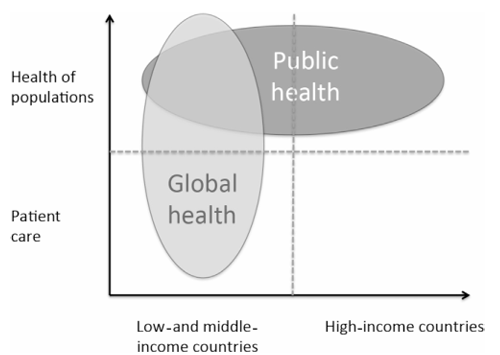{height=200}

:::

::::

## Applications of Global Health Informatics {.smaller background-image="img/global health informatics/application.jpg" background-size="40% 100%" background-position="left"}

:::: {.columns}

::: {.column width="40%"}

:::

::: {.column width="55%"}

- **Disease Surveillance**:
  - Communicable disease monitoring
  - Prediction

- **Enhancing access and equity in healthcare delivery**:
  - eHR
  - mHealth
  - Telemedicine

- **Policy advocacy and evaluation**

:::

::::

## Enhancing access and equity in healthcare delivery

- Enhancing healthcare access for LMICs and rural populations
- Health education
- Personalized monitoring
  

## Enhancing access and equity in healthcare delivery {.smaller}

:::: {.columns}

::: {.column width="50%"}

:::: {.columns}

::: {.column width="46%"}

:::
::: {.column width="46%"}
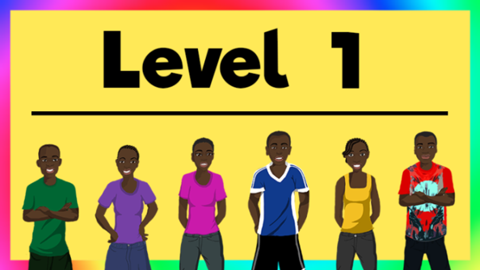
:::
::::

- **Non-Prep HIV prevention in Kenya** [@mwaisaka2021young]: Improving on
  - Enhanced knowledge
  - Self-efficacy
  - Behavioral intention
:::

::: {.column width="50%"}
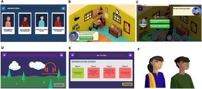

- **Youth mental health in India** [@gonsalves2019design]: 
  - Gamification
:::

::::

## Disease surveillance

- Enhancing information transparency
- Evidence foundation
- Monitoring disease transmission
- AI prediction of future trends

  
::: {.callout-tip}
## Before we go through example
- Have you tried visiting surveillance tools?
  - What kind of information do you usually look for?
  - How will you use these data?
:::

## Disease surveillance {.smaller}

:::: {.columns}

::: {.column width="50%"}

:::: {.columns}

::: {.column width="46%"}
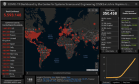
:::
::: {.column width="46%"}
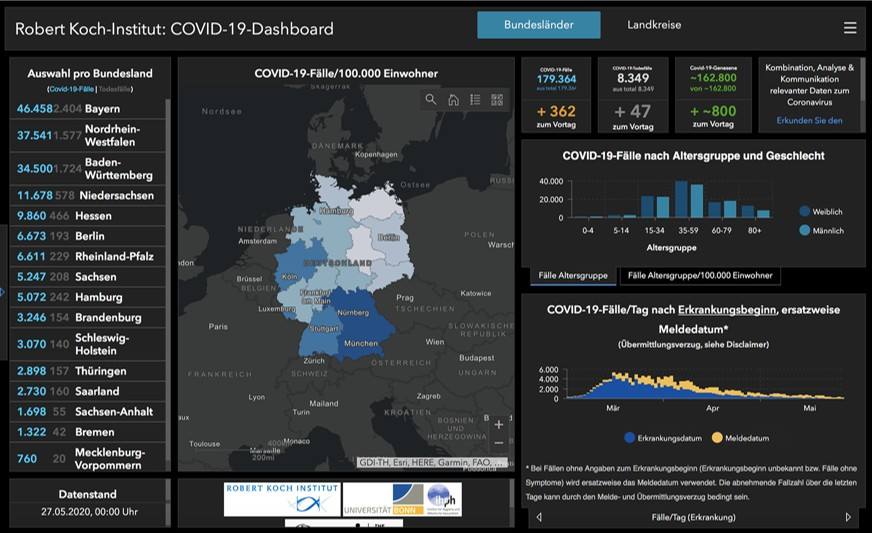
:::
::::

- **Dashboard for COVID-19** [@Jonathan2020]:
  - Intervention
  - Surveillance
- Arguments:
  - Nationalism
- Neglecting social determinants of health

:::

::: {.column width="50%"}
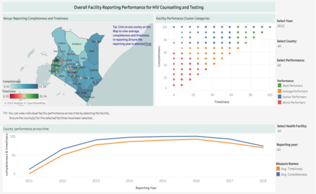

- **Dashboard for HIV in Kenya** [@gesicho2022designing]: 
  - Leveraging DHIS2 system (WHO system) for integrating reporting and surveillance

:::

::::

## Decision support and policy

:::: {.columns}

::: {.column width="60%"}
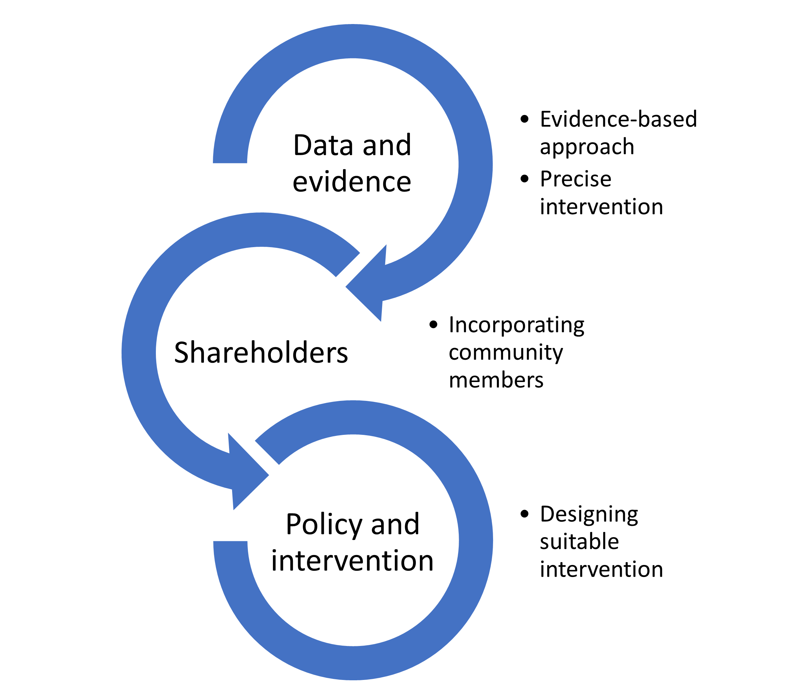
:::

::: {.column width="40%"}

:::

::::

# Challenges in Global Health Informatics {background-image="img/global health informatics/cac.jpg" background-size="40% 100%" background-position="left"}

## Challenges in global health informatics

:::: {.columns}

::: {.column width="25%"}
- Leavitt’s diamond framework [@wigand2007building]
:::

::: {.column width="75%"}
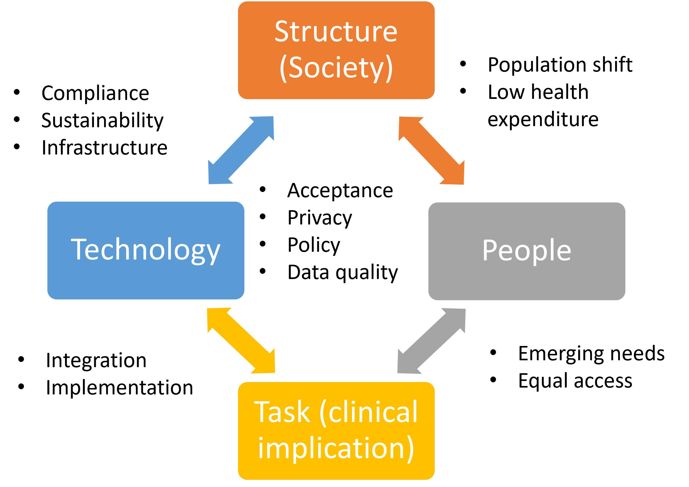{height=450}

:::

::::

# Getting Global Data {background-image="img/global health informatics/data.jpg" background-size="40% 100%" background-position="left"}

## Role of the data in the global health context {.smaller}

- Detect disease outbreaks
- Monitor health trends
- Improve service coverage
- Track risk factors
- Guide evidence-based actions
- Inform and evaluate public health policies

## Fantastic data and where to find them 

**Measuring dimensions**

  - Health economics
  - Mortality and life expectancy
  - Global issues
  - Social determinants of health
- Child and women's health
  - Infectious disease

## Global Burden of Disease (GBD) {.smaller}

:::: {.columns}

::: {.column width="30%"}
- GBD dataset focuses on health loss across:
  - Diseases
  - Places
  - Time
- Additional items:
  - Demographic
  - Fertility
  - Life expectancy
  - Socio-Demographic Index
  - DALY/HLY

:::

::: {.column width="70%"}
](img/global health informatics/gbd.png)

:::

::::

## Global Health Expenditure Database (GHED) {.smaller}

:::: {.columns}

::: {.column width="40%"}
- Tracking and analyzing health spending trends
- Assessing health expenditure by different levels:
  - Sources (e.g., government, households, donors)
  - Financing mechanisms (compulsory vs. voluntary)
  - Country-wise comparison
:::

::: {.column width="60%"}
](img/global health informatics/ghed.png){height=400}

:::

::::

## Global Health Observatory (GHO) {.smaller}

Global Health Observatory is the data hub from WHO aggregating all the data under the WHO umbrella

](img/global health informatics/gho.png)

## Multiple Income Cluster Survey (MICS) {.smaller}

:::: {.columns}

::: {.column width="40%"}
MICS is a survey under UNICEF focusing on women and children in LMIC:

  - Child health
  - Child development
  - Literacy
  - Protection
  - HIV
  - Well-being

:::

::: {.column width="60%"}
](img/global health informatics/mics.png)

:::

::::

## Challenges in global health data {background-image="img/global health informatics/survey.jpg" background-size="40% 100%" background-position="left"}

::: {.callout-tip}
## Discussion
  - Is WHO data reliable?
  - Will there be any potential bias in global data?
:::

. . .

**How does WHO get the data**

- Survey
- Liaise with local government officials

## Implication on global health data quality {.smaller}

:::: {.columns}

::: {.column width="50%"}
**Integrating data worldwide**

Collecting and maintaining data worldwide is challenging
Resources:

  - Standard coding (ICD-9/ICD-10/ICD-11/DSM-V)
  - Deidentification

:::

::: {.column width="50%"}
**Cultural context and bias in the data**

Items with strong cultural stigma or illegal behavior are usually underreported or missing

- Drug overuse
- AIDS
- Mental health
:::

::::

# Presenting Health Data {background-image="img/global health informatics/present.jpg" background-size="40% 100%" background-position="left"}

## Principle of visualizing data
:::: {.columns}

::: {.column width="40%"}

- **Effective**: Information conveyed by one visualization is more readily perceived
- **Expressiveness**: The visualizations express all the facts in the set of data, and only the facts in the data

:::

::: {.column width="60%"}
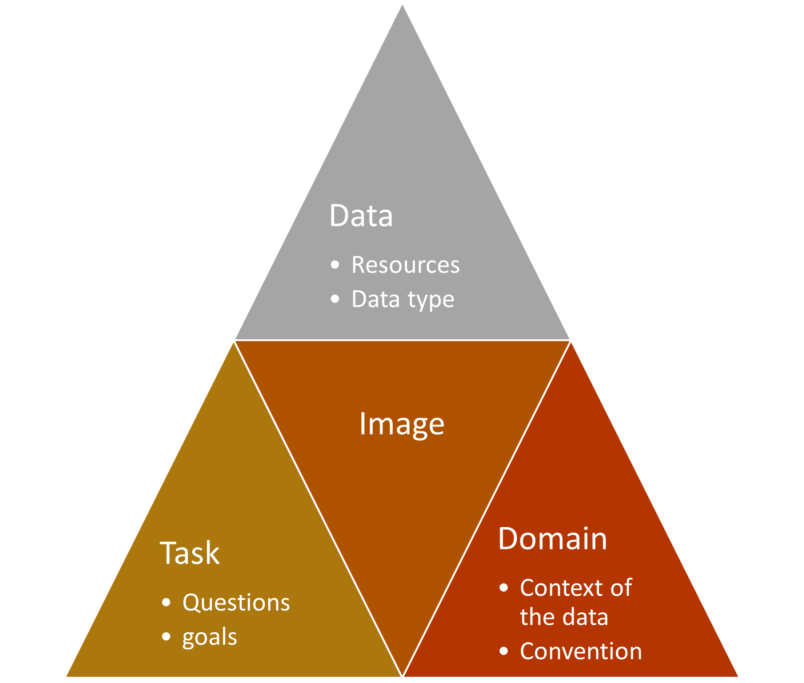

:::

::::

## Principle of visualizing data

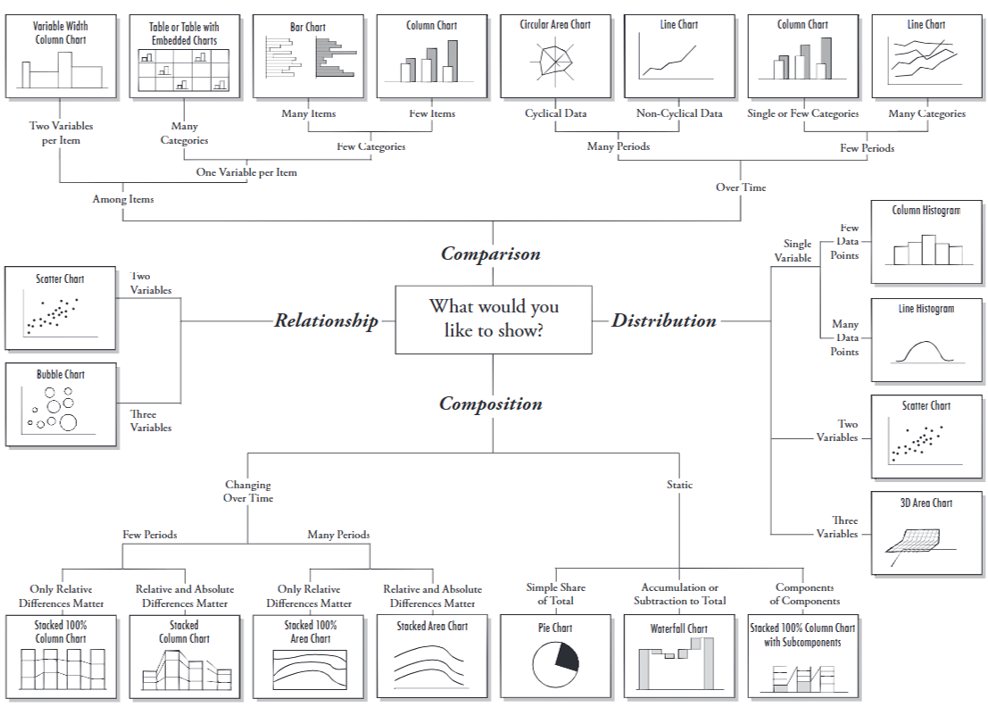{height=500}

# Mackinlay’s Ranking

## Motivations {.smaller}

:::: {.columns}

::: {.column width="40%"}

- When more than two variables need to be presented (hopefully in one graph):
  - What is the best way to present them?
  - What are the pre-attentive features (easily perceived by humans)?
:::

::: {.column width="60%"}
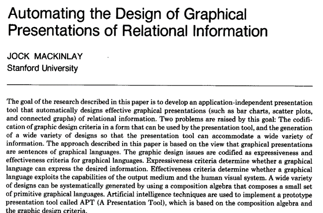

:::

::::

## Pre-attentive features {.smaller}

:::: {.columns}

::: {.column width="20%"}

- Location
- Colour:
  - Hue
  - Saturation
- Shape:
  - Length
  - Shape
  - Texture
  - Area
:::

::: {.column width="50%"}
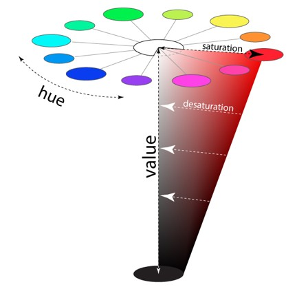

:::

::: {.column width="30%"}
Combinations of pre-attentive features are not pre-attentive, e.g., Red triangle vs. Green rectangle

:::

::::

## Mackinlay’s Ranking
:::: {.columns}

::: {.column width="30%"}

- Mackinlay developed the ranking to choose the best way to present data
- Rule of thumb: Don’t go to ranking below 5
:::

::: {.column width="70%"}
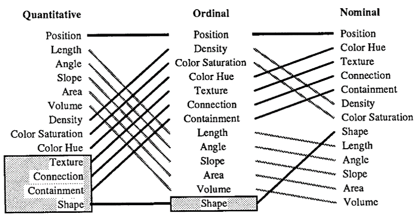

:::
::::

## Social and cultural context consideration {.smaller}
:::: {.columns}

::: {.column width="70%"}

- Color-blindness friendly
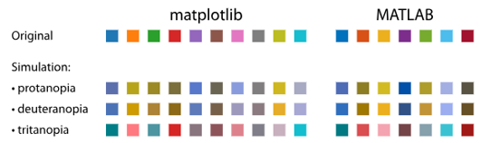{height=200}
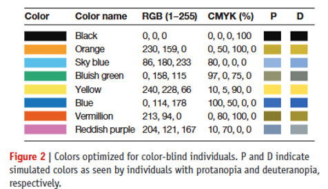{height=200}

:::

::: {.column width="30%"}
**Cultural context**:

- Blue and red:
  - Sex
  - Severity
  - Politics
- Red and green:
  - Chinese and Western stock market

:::
::::

## Example

](img/global health informatics/bad1.png){height=450}

## Example

](img/global health informatics/bad2.png){height=450}

## Example

](img/global health informatics/bad3.png){height=450}

## Example

](img/global health informatics/bad4.png){height=450}

## Example

](img/global health informatics/bad5.png){height=450}

## Bibliography
