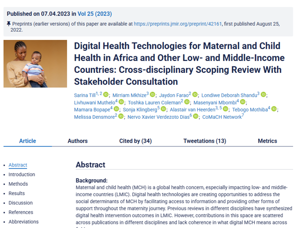
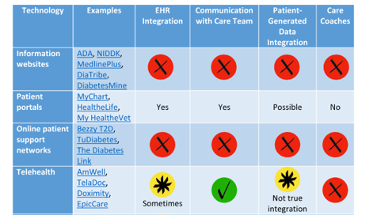
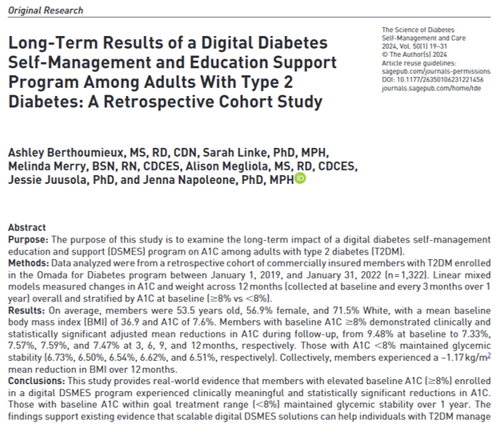
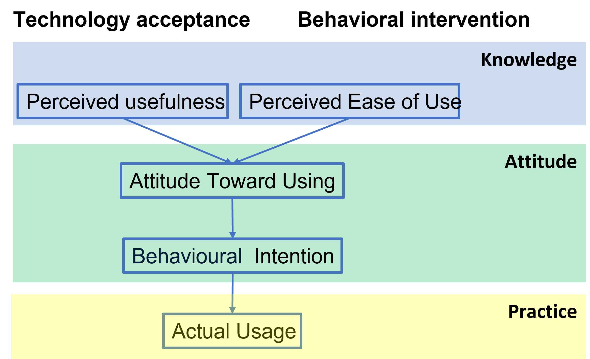

## Learning Objectives {background-image="img/mHealth and telemedicine/clo.jpg" background-size="40% 100%" background-position="left"}

:::: {.columns}

::: {.column width="40%"}

:::

::: {.column width="60%"}
- Understand digital health in the global health context
- Explore roles and applications of digital health
- Learn to design, implement, and evaluate digital health interventions
- Identify challenges of mHealth and telemedicine in global health

:::

::::

# Digital Health {background-image="img\mHealth and telemedicine\d_health.png" background-size="50% 100%" background-position="left"}

## Digital Health: Definition {.smaller}

:::: {.columns}

::: {.column width="40%"}
- **Definition**: The use of information and communications technology in support of health and health-related fields [@world2017global]
- An umbrella term that encompasses various information technology solutions for health

:::

::: {.column width="55%"}

](img\mHealth and telemedicine\d_health_2.jpg)

:::
:::

## Discussion 1: Do global, start local

::: {.callout-tip}
## Local example of digital health 

1. Have you heard or tried any digital health product or service?
2. how does it benefit your health ?
3. Why do you use them ?

:::

## Fuel up digital health technology

- Technology
  - Increasing coverage of internet and smartphone
- User engageement and empowerment
  - People are more familiar with new technology
- Global health
  - WHO recognized mHealth as a tool for enhancing healthcare systems @kay2011mhealth
- Research, policy and business
  - Economic potentials

## Quadruple Aim of Digital Health {.smaller}

:::: {.columns}

::: {.column width="40%"}

Proposed by @bodenheimer2014triple:

1. Improving the health of populations
2. Reducing the cost of healthcare
3. Improving the individual experience of care
4. Improving the experience of providing care

:::

::: {.column width="60%"}

:::
:::

## Improving Population Health {.smaller}

:::: {.columns}

::: {.column width="33%"}
**Health Promotion and Education**

- Health education initiatives
- Combating misinformation [@miller2024countering]

:::

::: {.column width="33%"}
**Disease surveillance**

- Surveillance
- Targeting intervention [@gesicho2022designing]

:::

::: {.column width="33%"}

**Personalized Devices and Behavior**
  - Precision medicine
  - Promoting healthy behaviors

](img\mHealth and telemedicine\personalize.png)

:::
:::

## Reducing the Cost of Healthcare

:::: {.columns}

::: {.column width="60%"}
Reducing the cost of healthcare in

- **Low-Cost Alternatives**:
  - Digital medicine reduces human and logistic costs
- **Preventive Approach**:
  - Lowers potential future healthcare costs

:::

::: {.column width="40%"}

:::
:::

## Improving Individual Experience of Care {.smaller}

:::: {.columns}

::: {.column width="60%"}

- **Connected Care Integration**:
  - TB treatment adherence in India [@narasimhan2014customized]
- **Just-in-Time Interventions**:
  - Alcohol overuse intervention for adolescents [@haug2020assessment]
- **Destigmatization**:
  - Digital platforms provide anonymity for sensitive conditions
    - HIV [@mulawa2021mhealth]
    - Mental health [@kim2022overcoming]

:::

::: {.column width="35%"}

:::
:::

## Improving Experience of Providing Care {.smaller}

:::: {.columns}

::: {.column width="60%"}

- **Telemedicine**:
  - During COVID-19 [@mahmoud2022telemedicine]
  - Mental health support [@acharibasam2018telemental,@maha2024transforming]
- **Integrated Healthcare Information**:
  - Healthcare information systems in Kenya [@celi2020leveraging]

:::

::: {.column width="35%"}

:::
:::

# Design, implement, and evaluation {background-image="img/mHealth and telemedicine/design.png" background-size="40% 100%" background-position="left"}

## Implement digital health product as a PM {.smaller}

:::: {.columns}

::: {.column width="60%"}

**Importance of Participatory Design**

@nelson2013health proposed system life life cycle of health informatics 

1. Analyze
2. Plan
3. Develop
4. Test
5. Implement
6. Maintain
7. Evaluate

:::

::: {.column width="40%"}

:::
:::

# Participatory digital medicine design {background-image="img\mHealth and telemedicine\particepatory.jpg" background-size="40% 100%" background-position="left"}

## Participatory design {.smaller}

:::: {.columns}

::: {.column width="60%"}

**Importance of Participatory Design**

  - Involves patients and professionals for better outcomes
  - Aligns with P4 medicine goals
    - predictive 
    - preventive
    - personalized 
    - participatory
  - Enhances communication and adherence

:::

::: {.column width="40%"}

Through the participatory medicine approach

- Better health outcome
  - Better communication
  - Personalized design of intervention
  - Higher adherence to the treatment

:::
:::

## Non-Participatory Design Pitfalls {.smaller}

:::: {.columns}

::: {.column width="40%"}

**@till2023digital: Maternal and Child Health in LMICs**

  - Failure to identify target users' needs
  - Lack of lived experience and community engagement
  - Neglecting cultural contexts
  - Excluding stakeholders in the user's circle

:::

::: {.column width="60%"}

:::
:::

## Participatory – example in diabetes  {.smaller}

:::: {.columns}

::: {.column width="40%"}

- Diabetes patients are heterogenous in many aspects

  - Using CGM for continuous monitoring 
  - Connected care with health coach
  - EHR integration

:::

::: {.column width="60%"}

:::
:::

# Intervention strategy {background-image="img/mHealth and telemedicine/intervention.jpg" background-size="40% 100%" background-position="left"}

## Intervention Strategy: Technology Acceptance Model (TAM) {.smaller}

::: {.callout-tip}
## Adopting new technology

 1. What new app/technology product/healthy lifestyle have you recently given up?
 2. What were your initial motivations for trying it?
 3. Why did you give up? How long did you sustain it before giving up?

:::

:::: {.columns}

::: {.column width="50%"}

Technology acceptance model (TAM) was proposed in @davis1989perceived and @davis1996critical
:::

::: {.column width="50%"}

:::
:::

## Intrinsic and extrinsic factors on TAM {.smaller}

:::: {.columns}

::: {.column width="40%"}
From the TAM model, it is no clear how do we increase individual's knowledge. 

@venkatesh2000theoretical shows that social norms and competence are important in shaping user’s perception.

It suggest some direction of intervention

- Eliminating stigma and promotion
- Provide good quality of work

:::

::: {.column width="60%"}

:::
:::

# Evaluation {background-image="img\mHealth and telemedicine\evaluation.png" background-size="40% 100%" background-position="left"}

## Evaluating Digital Health Interventions

:::: {.columns}

::: {.column width="40%"}

- **[@zhang2025stakeholder] Three Dimensions of Evaluation**
  - Theme
  - Stakeholders
  - Stage
:::

::: {.column width="60%"}

:::
:::

## Stakeholder x Theme {.smaller}
 
:::: {.columns}

::: {.column width="40%"}

- Different interest across themes and stakeholders
- Program developer
  - Implementation
- Provider and patient
  - Clinical impact
- Institution 
  - Econmic impact
- Policy maker
  - Potential compliance issue in different aspects
:::

::: {.column width="60%"}

:::
:::

## Stage x Theme

:::: {.columns}

::: {.column width="40%"}

Shiffting focus along the way of product development

- Implementation evaluation come on the early stage
- Clinical and socioeconomic impact come in the late stage
:::

::: {.column width="60%"}

:::
:::

## Implementation Challenges in the Global Health context {.smaller}

- Policy
  - Standardization
  - Monitoring and evaluation
  - Infrastructure
- Patients
  - Urgency
  - Attitude toward digital technology
- Service provider
  - Training
  - Attitude toward digital technology

## Future of digital health

:::: {.columns}

::: {.column width="40%"}

- @rivas2023digital proposed an intergrative data sharing platform of digital footprint
  
::: {.callout-tip}
## Future of digital health

What will be the future digital health technology look like?

:::

:::

::: {.column width="60%"}

:::
:::

## Further reading

The material covers in this slide is majorly referenced  and @alma991044006367603414

## Bibilography

