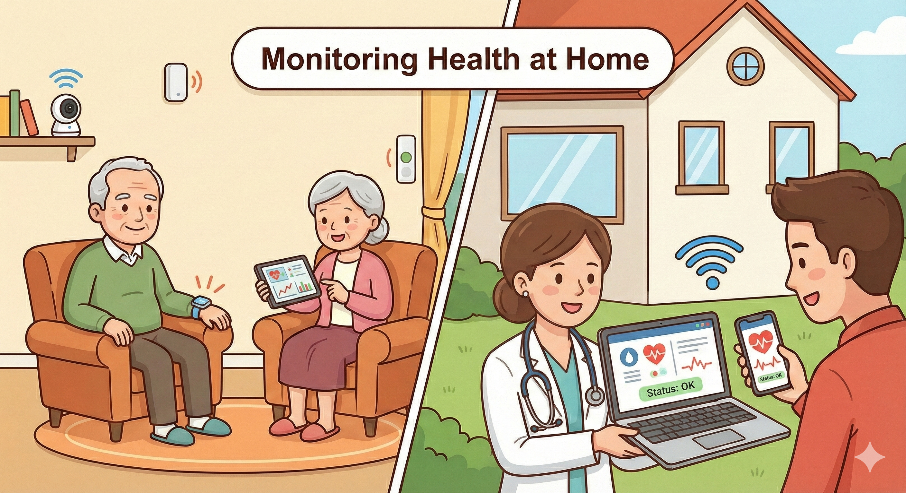
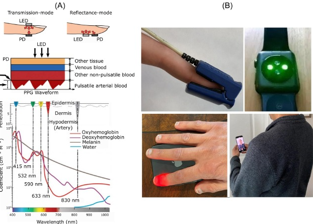
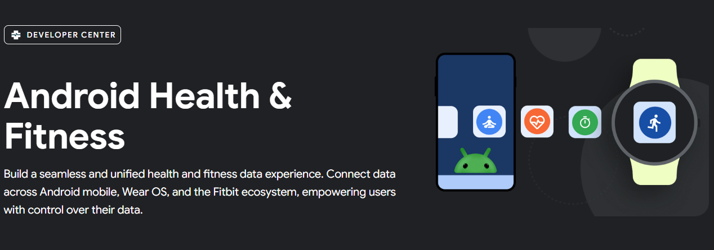
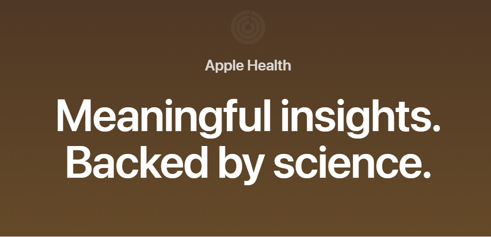
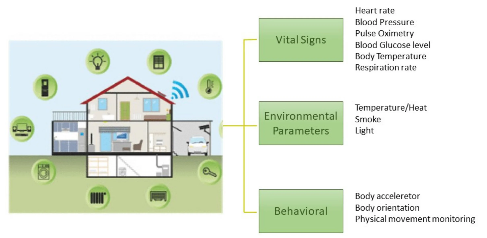

## Learning outcomes {.smaller}

1. Understand the challenges and opportunities of health monitoring for older adults
2. Learn about different types of health monitoring technologies and their applications
3. Explore the ethical considerations and future perspectives of health monitoring for older adults

# Aging Society

## Population aging {.smaller}

:::{.columns}
:::{.column}
- Aging is a global issue, especially in developed countries
- **Definition**
  - More than 7% of population aged 65 or more
- **Reason**
  - Longevity
  - Lower fertility rate
:::
:::{.column}

{.preview-image}

:::
:::

## Challenges - physical frailty {.smaller}

:::{.columns}
:::{.column width=45%}
A practical challenges is decline of function along with aging 

- Physical
  - Reduce muscle mass
  - Lower bone density
- Cognitive
  - Reduce processing speed
  - Reduce working memory
  - Reduce execution speed
- Consequence
  - Prone to injury
:::

:::{.column width=50%}
{width=75%}
:::

:::

## Challenges - caregiver burnout {.smaller}

:::{.columns}
:::{.column width=50%}
Taking care of a people could result in

- Physical burnout
  - Physical exhaustion
  - Somatic symptoms
- Mental burnout
  - Stress
  - Depression

:::
:::{.column width=50%}
](img-adults/scmp-caregiver.png)
:::
:::

## Healthy aging {.smaller}

:::{.columns}
:::{.column}

**Definition**: Developing and maintaining functional ability

- Functional ability
  - Meet basic needs
  - Learn,grow, and make decision
  - mobility
  - Build and maintain relationship
  - Contribute to society
:::
:::{.column}

:::
:::

# Health monitoring of older adults

## Health monitoring of older adults {.smaller}

:::{.columns}
:::{.column}

- Technology could help
  - Extend healthy aging duration
  - Lowered threshold to achieve functional ability

:::

:::{.column}

:::

:::

## Older adults health monitoring {.smaller}
 
 Health monitoring assist older adults life in 

:::{.columns}

:::{.column}

**Older adult health**

- Continuous monitoring leads to
  - Early prevention
  - Chronic condition management

:::

:::{.column}

**Caregiver perspective**

- Reduced caring burden
- Easier health information management
- Remote management
:::

{width=45%}

:::

## Wearable devices {.smaller}

:::{.columns}

:::{.column width=45%}

Wearable devices monitoring 

- Cardiovascular health
  - Heart rate
  - Blood pressure
  - Electrocardiogram (ECG)
- Respiratory health
  - Blood oxygen level
  - Respiratory rate
- Activities
  - Exercise
  - Sleep
:::

:::{.column width=50%} 

**Sensor technology**

- Photoplethysmography
{width=70%}

- Accelerometer
- ECG

:::

:::

## Domestic health monitoring machines for targeted purpose {.smaller}

:::{.columns}

:::{.column width=46%}

**Spirometry**

- Pulmonary functional test
- Monitoring chronic pulmonary disease (COPD, asthma)

)](img-adults/DoingSpirometry.JPG){width=80%}
:::

:::{.column width=46%} 

**Continuous glucose monitor (CGM)**

- Glucose monitoring for diabete patients

)](img-adults/cgm.JPG){width=70%}

:::

:::

## Consideration of using wearable devices {.smaller}

:::{.columns}

:::{.column width=47%}

- Data formatting
- Interpretation of measured data
- Integration of different data modality
  - Android Health connect
  - Apple Health

:::

:::{.column width=47%} 

:::

:::

## Ambient assisted living{.smaller}

:::{.columns}

:::{.column width=40%}

The other type of older adults monitoring is environmental monitoring

- Camera
  - Fall
- Gas
  - Smoke
  - Air Quality
- Humidity
- Light
- Temperature

:::

:::{.column width=55%} 

:::

:::

## AI-enabled monitoring {.smaller}

:::{.columns}

The problem of the simply monitoring is that we don't take further steps.

:::{.column width=40%}

**Rule-based automation**

Popular options include IFTTT (if this, then that) or Apple/Google Home built-in rule-based automation

- Example
  - IF "Temperature > 26"
  - Then "Turn on Air con"

:::

:::{.column width=55%} 

**LLM-enabled home automation**

- Incorporate personal records, behavior to execute actions
- Lowered coding requirements for automation

:::

:::

## Online-offline collaboration {.smaller}

:::{.columns}

The other type of monitor-to-action is connecting to offline supports

:::{.column width=47%}

**Healthcare systems**

- Reporting health monitoring records for clinician as extra evidence
- Emergency calling for stroke, fall events 

](img-adults/appleFall.png)
:::

:::{.column width=47%} 

**Social support**

- Connecting to social services
- Emergency call service (平安鐘)

](img-adults/caeroncall.png)

:::

:::

# Implementation aspects

## Accepting new technology {.smaller}

Older adults are usually less accepting of new technology

Factors affect older adults' attitude toward new technology

- Perceived usefulness
- Perceived ease of use

The actual usefulness is not the key. The key is to facilitate older adults **perceive** its usefulness

## Implementation

Some useful way to increase adoption rate of health monitoring technology

- Active communication with older adults
- Incentives
- Peer / authoritative engagement

## User interface design {.smaller}

- Simple and intuitive interface for older adults
- Clear and concise information display

In-class reading: [FDA issues safety alert on Trividia blood glucose monitors](https://www.fiercebiotech.com/medtech/fda-issues-safety-alert-trividia-blood-glucose-monitors)

Guided questions:

- What are the difference between original instruction and revised instruction
- What are the potential consequences of the original instruction?
- Regulatory strategy for health monitoring devices, is the safety of the device is the only concern?  
- Business perspectives: What are other ways to fix the error, and what are the potential costs?

## { width="75" height="75"} {.smaller  visibility="uncounted"}

<iframe sandbox='allow-popups allow-scripts allow-same-origin allow-presentation' allowfullscreen='true' allowtransparency='true' frameborder='0' height='315' src='https://www.mentimeter.com/app/presentation/aluj2h4bvnxoobqcuw7b5cgjg5mydszk/embed' style='position: absolute; top: 0; left: 0; width: 100%; height: 100%;' width='420'></iframe>

## { width="75" height="75"} {.smaller  visibility="uncounted"}

<iframe sandbox='allow-popups allow-scripts allow-same-origin allow-presentation' allowfullscreen='true' allowtransparency='true' frameborder='0' height='315' src='https://www.mentimeter.com/app/presentation/alc95ttnt3is4ccet996emtkzh3otgj6/embed' style='position: absolute; top: 0; left: 0; width: 100%; height: 100%;' width='420'></iframe>

## { width="75" height="75"} {.smaller  visibility="uncounted"}

<iframe sandbox='allow-popups allow-scripts allow-same-origin allow-presentation' allowfullscreen='true' allowtransparency='true' frameborder='0' height='315' src='https://www.mentimeter.com/app/presentation/alt535snvyzvhdce8f56shybe1abnqcx/embed' style='position: absolute; top: 0; left: 0; width: 100%; height: 100%;' width='420'></iframe>

## { width="75" height="75"} {.smaller  visibility="uncounted"}

<iframe sandbox='allow-popups allow-scripts allow-same-origin allow-presentation' allowfullscreen='true' allowtransparency='true' frameborder='0' height='315' src='https://www.mentimeter.com/app/presentation/alevwea552pkrhj9fqp1igc41fos9pkr/embed' style='position: absolute; top: 0; left: 0; width: 100%; height: 100%;' width='420'></iframe>

## Ethical consideration {.smaller}

- Privacy vs. Safety Trade-off
  - How much privacy are we willing to sacrifice for safety?
- Data ownership
  - Who owns the health data
    - Older adults 
    - Caregiver
    - Child
    - Device company

## Future perspective {.smaller}

- LLM integration
- Mental health
- More non-intrusive monitoring devices

## Design your own scenario {.smaller visibility="uncounted"}

:::{.columns}

The other type of monitor-to-action is connecting to offline supports

:::{.column width=45%}

- **Profile**: Mrs. Lin, 78 years old
- **Living situation**: living alone in an apartment
  - Two adult children live overseas
- **Mobility**: Walking slow, need to use a cane
- **Cognition**: Occasionally forget things
- **Health**: Managed hypertension and diabetes, early-stage hearing loss
:::

:::{.column width=50%} 

**Problem**

Her children are increasingly anxious. After the recent slip in the kitchen, they want to hire a full-time domestic helper, but Mrs. Lin refuses.

1. What are the potential biological signs could be monitored 
2. What are the potential house sensor could be installed to increase home safety
3. After installing 1. and 2. what are the potential action we can do if something happens? 
:::

:::

## Bibliography {.smaller}